# FlowSync — Real-Time Collaborative Project Management Platform

FlowSync is a multi-tenant work management platform. Teams organize work into organizations,
projects and Kanban boards, discuss tasks in comments, attach files, and get notified in the app
and by email, while every open browser stays in sync over WebSockets. It is a modular NestJS
monolith with a separate background worker, backed by PostgreSQL, Valkey (Redis-compatible) and
S3-compatible object storage, and the whole stack starts with a single `docker compose up`.


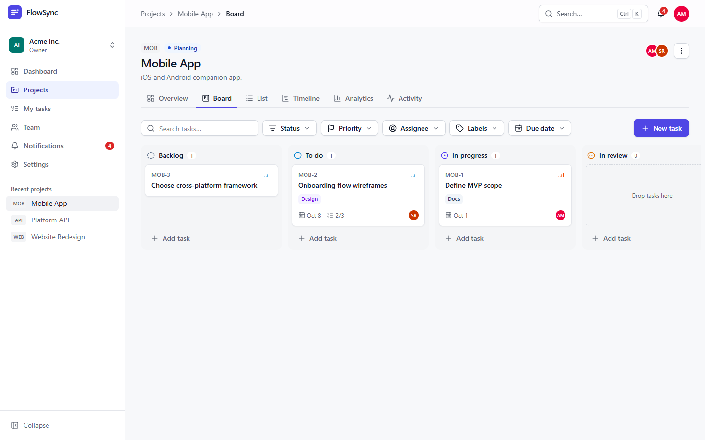

**Jump to:** [Overview](#product-overview) · [Workflow](#real-world-workflow) ·
[Features](#key-features) · [Architecture](#architecture) · [Request flows](#request-flow-examples) ·
[Database](#database-design) · [Security](#security) · [Real-time](#real-time-architecture) ·
[Run locally](#local-development) · [Testing](#testing) · [Talking points](#interview-talking-points)

<details>
<summary><b>Full table of contents</b></summary>

- [Product overview](#product-overview)
- [Real-world workflow](#real-world-workflow)
- [Key features](#key-features)
- [Architecture](#architecture)
- [System design](#system-design)
- [Request flow examples](#request-flow-examples)
- [Database design](#database-design)
- [Multi-tenancy and data isolation](#multi-tenancy-and-data-isolation)
- [Security](#security)
- [Real-time architecture](#real-time-architecture)
- [Background worker architecture](#background-worker-architecture)
- [File storage architecture](#file-storage-architecture)
- [API documentation](#api-documentation)
- [Tech stack](#tech-stack)
- [Project structure](#project-structure)
- [Local development](#local-development)
- [Demo credentials](#demo-credentials)
- [Testing](#testing)
- [Docker services](#docker-services)
- [Engineering highlights](#engineering-highlights)
- [Scalability considerations](#scalability-considerations)
- [Observability and reliability](#observability-and-reliability)
- [Screenshots](#screenshots)
- [Interview talking points](#interview-talking-points)
- [Known limitations](#known-limitations)
- [Future improvements](#future-improvements)
- [Further documentation](#further-documentation)
- [License](#license)

</details>

---

## Product overview

**What is FlowSync?** A shared workspace where a team plans and tracks work together. Each team
gets an **organization** with members and roles. Organizations contain **projects**, projects
contain **tasks** on a Kanban board, and tasks carry comments, checklists, labels, attachments and
a full activity history.

**What problem does it solve?** On a team, the status of work goes stale fast. If someone moved a
card five minutes ago and your tab doesn't know, people pick up work that is already taken, miss
comments and chase updates in chat. FlowSync keeps boards, task details, comments and
notifications current in every open session. It also routes each change to the people who need it
(assignees, reporters, mentioned teammates), in the app and by email.

**Who would use it?** Product and engineering teams, agencies that run one workspace per client,
and any group that needs role-based access, from owners and admins down to read-only viewers.

**What makes it more than a CRUD app?**

| Concern          | How FlowSync handles it                                                                                                       |
| ---------------- | ----------------------------------------------------------------------------------------------------------------------------- |
| Tenancy          | Organizations are hard boundaries, enforced on every request **and** by composite foreign keys in PostgreSQL                  |
| Consistency      | Writes run in PostgreSQL transactions. Side effects (notifications, email, real-time events) are dispatched after commit       |
| Real-time        | Authorized WebSocket channels with Redis pub/sub fan-out, token re-auth on long-lived sockets and instant session revocation |
| Asynchronous work | A separate worker process with retrying BullMQ queues and scheduled maintenance jobs                                          |
| Security         | Argon2id, rotating refresh tokens with reuse detection, account lockout, content-verified uploads, CSP                        |
| Operability      | Health probes, structured logs with request correlation, hardened containers, CI with real-service integration tests         |

## Real-world workflow

The walkthrough below uses the seeded **Acme Inc.** workspace ([demo credentials](#demo-credentials)).

1. **Sign up and verify.** Sofia registers. The API stores an Argon2id hash and queues a
   verification email, which Mailpit catches locally. She cannot sign in until she opens the link.
2. **Join the workspace.** Alex (Owner) invites Sofia's address as a *Member* from the Team page.
   The invitation email links to `/accept-invitation`. If the address registers later, verifying it
   accepts pending invitations automatically.
3. **Organize work.** Marcus (Manager) creates the *Mobile App* project with key `MOB` and adds
   members. Its tasks get identifiers `MOB-1`, `MOB-2`, and so on.
4. **Plan tasks.** Each task has a status (Backlog → To do → In progress → Review → Done), priority,
   assignee, due date, labels, a checklist and a description. Assigning `MOB-2` to Sofia queues a
   `TASK_ASSIGNED` notification, delivered in the app and, by default, by email.
5. **Work the board.** Sofia drags `MOB-2` to *In progress*. Her board updates immediately
   (optimistically), and anyone else viewing the project sees the card move without refreshing. The
   task's reporter gets a status-change notification.
6. **Discuss.** Marcus comments `@sofia.rodriguez@acme.example can you share the wireframes?`. The
   API resolves the mention to a member of this organization, stores it, and Sofia receives a
   `MENTIONED` notification: the bell count updates, a toast appears and an email is sent.
7. **Share files.** Sofia attaches `wireframes.pdf`. The API verifies the file's actual content,
   stores it in object storage, and the task drawer updates for everyone viewing it.
8. **Stay on schedule.** An hourly worker job reminds assignees about open tasks due today or
   tomorrow, at most once per task and due date.
9. **Find things.** <kbd>Ctrl</kbd> + <kbd>K</kbd> searches projects, tasks (including by identifier,
   e.g. `MOB-2`) and people across the organization.
10. **See progress.** The dashboard and project analytics show completion trends, workload per
    member and project progress. The numbers are aggregated in SQL and cached per organization.
11. **Stay safe.** Removing a member immediately drops their real-time subscriptions to that
    organization, and signing out a device closes its open WebSocket.

## Key features

Everything below is available in the web UI unless it is marked **API only**, which means the
backend endpoint exists but has no screen yet (see [Known limitations](#known-limitations)).

### Authentication and account security

- Registration with a password strength meter. Email verification is required before sign-in
  (configurable with `AUTH_REQUIRE_EMAIL_VERIFICATION`).
- Sign-in with "keep me signed in" (30-day sliding session) or a browser-session login (24 hours).
- Short-lived JWT access tokens plus a rotating, httpOnly refresh cookie. The client refreshes
  silently on `401`, with a single refresh request shared by concurrent callers.
- Forgot/reset password: a single-use link valid for 1 hour. A reset signs out every session.
- Password change signs out all other devices.
- Device session manager: list sessions (device, browser, OS, IP, last active) and revoke one or all.
- Per-IP rate limits on auth endpoints, plus a per-account lockout after repeated failures.
- Account deletion with anonymization, which keeps authored history intact (**API only**).

### Organizations and teams

- Multiple organizations per user, with an organization switcher.
- Five roles: Owner, Admin, Manager, Member, Viewer. The API enforces them; the UI mirrors them
  (`<Can>`) only to hide controls the user can't use.
- Email invitations (7-day expiry) with resend, revoke and an acceptance page.
- Member directory, member profiles with task stats, role changes, removal, and leaving an
  organization.
- Organization-wide labels in 10 colors. Labels can be applied in the UI; creating and editing them
  is **API only**.
- Ownership transfer (**API only**).

### Projects and tasks

- Projects with a short key (`WEB`, `MOB`), a status (Planning, Active, On hold, Completed,
  Archived), an owner, start and due dates, and members.
- Project views: Overview, Board, List (sortable table), Activity and Analytics. The Timeline tab is
  a placeholder that lists open tasks by due date.
- Tasks with per-project identifiers (`MOB-42`), status, priority, assignee, reporter, due date,
  labels, a checklist and a description.
- Kanban drag and drop with mouse, touch **and keyboard** (dnd-kit with screen-reader
  announcements), using optimistic updates that roll back on error.
- Filters for status, priority, assignee, labels, due date and text, plus a cross-project
  *My tasks* page.
- Soft delete into a 30-day trash that the worker purges. Restore is **API only**.

### Real-time collaboration

- Boards, lists, open task drawers, comments, notifications and membership changes update live.
- Channels are authorized per organization and per project, and every user has a private channel.
- Automatic reconnect with exponential backoff and jitter, re-authentication on the open socket,
  and a refetch of on-screen data after every reconnect.
- If the socket is down, the unread-notification count falls back to polling.

### Communication and notifications

- Task comments: create, edit (author only) and delete (author, or Admin and above for moderation).
- @mentions: writing `@member@example.com` in a comment (or sending `mentionedUserIds` through the
  API) notifies members of the organization. The UI has no autocomplete picker yet.
- Seven notification types: assigned, commented, mentioned, due soon, status changed, added to
  project, member joined.
- Notification center (bell and full page, unread filter, mark read or mark all read) with live toasts.
- Email notifications over SMTP. Each notification type has its own in-app and email toggles in
  Settings.
- Hourly due-date reminders.

### File management

- Task attachments up to 25 MB, at most 100 per task. Allowed types: images, PDF, Office documents,
  ZIP, and text/CSV/Markdown/JSON.
- The file type is verified from the file's contents (magic bytes), not from its name.
- Files live in a private bucket. Downloads use 15-minute presigned URLs that force
  `Content-Disposition: attachment`.
- Avatars in PNG, JPEG, GIF or WebP, up to 5 MB.
- Presigned direct-to-storage uploads with server-side verification (**API only**).

### Search, analytics and history

- Organization-wide search (<kbd>Ctrl</kbd> + <kbd>K</kbd>) across projects, tasks (by title or
  identifier) and members.
- Dashboard: summary stats, my tasks, a created-vs-completed trend, team workload, project progress
  and recent activity.
- A per-project analytics page: totals, overdue count, average cycle time, a created-vs-completed
  trend, status and priority breakdowns, and workload by member.
- Extended organization analytics: completion rate compared with the previous window, overdue
  breakdown, activity metrics and organization-wide task statistics (**API only**).
- Background CSV exports (task export and project summary) to object storage (**API only**).
- Activity feeds per organization, project and task. An append-only audit log is readable by
  Owners and Admins (**API only**).

### Developer experience

- A one-command Docker stack with health-gated startup and automatic migrations.
- Prisma migrations and an idempotent seed (2 organizations, 4 projects, 8 users).
- Swagger UI that documents all 98 API operations. An integration test keeps it complete.
- 178 automated tests: backend unit tests, backend integration tests against real
  PostgreSQL/Valkey/S3, and frontend tests.
- A GitHub Actions pipeline covering format, lint, typecheck, tests, build, a migration drift check
  and a container smoke test.

## Architecture

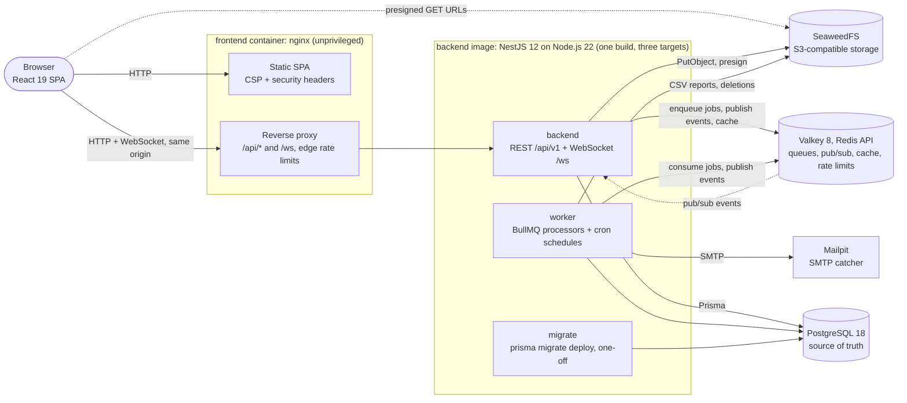

| Component                  | Responsibility                                                                                                                                                                                     |
| -------------------------- | -------------------------------------------------------------------------------------------------------------------------------------------------------------------------------------------------- |
| **frontend** (nginx)       | Serves the built SPA with a strict CSP and proxies `/api` and `/ws` to the backend, so the browser sees **one origin**: cookies, CORS and the WebSocket origin check all stay same-origin. Applies per-IP edge rate limits. |
| **backend** (API)          | REST API under `/api/v1` and the WebSocket gateway at `/ws`. Validates, authorizes and commits writes, then enqueues side effects and publishes real-time events. Keeps no correctness-relevant state in memory. |
| **worker**                 | Same codebase, different entry point (`dist/worker.js`). Runs the BullMQ processors (notifications, email, CSV reports, maintenance) and the cron schedules. Serves only a health endpoint on port 4001. |
| **migrate**                | One-off job that runs `prisma migrate deploy`. The backend and worker wait for it to exit successfully.                                                                                              |
| **PostgreSQL**             | All durable data: users, sessions, tenants, projects, tasks, comments, notifications, activity and audit logs, report metadata.                                                                   |
| **Valkey** (Redis API)     | BullMQ queues, real-time pub/sub, caches (membership, resource scope, analytics), shared rate-limit counters, the revoked-session denylist, login-failure counters and reminder de-duplication markers. |
| **SeaweedFS** (S3 API)     | Attachment, avatar and report bytes. PostgreSQL stores only metadata and object keys. Browsers download files directly with presigned URLs.                                                         |
| **Mailpit**                | Local SMTP server that catches every outgoing email (UI on port 8025). In production this would be a real SMTP provider.                                                                          |

**Why this shape.** A modular monolith keeps one codebase, one schema and real database
transactions, which fits a product whose core operations touch several tables at once. Slow,
retryable or scheduled work (email, notification fan-out, CSV generation, cleanup) runs in a
separate worker process, so it can never block or fail a user's request, and the two processes can
be scaled independently. Details: [docs/architecture.md](docs/architecture.md).

## System design

### Frontend layer

A React 19 SPA ([`frontend/src`](frontend/src)) organized by feature under `features/*`: pages,
components, TanStack Query hooks and real-time handlers for each domain.

- **Server state** lives only in the TanStack Query cache. Mutations update it optimistically and
  reconcile with the server response. Real-time events patch the cache directly
  ([`features/tasks/realtime.ts`](frontend/src/features/tasks/realtime.ts)).
- **Client state** (auth, active organization, UI preferences, toasts) lives in small Zustand
  stores. The access token is kept **in memory only**. On page load the session is restored from
  the httpOnly refresh cookie.
- **HTTP** goes through one Axios client ([`lib/http/client.ts`](frontend/src/lib/http/client.ts))
  that adds an `X-Request-Id` to every call and runs a single-flight refresh-and-retry on `401`.
- **Routing** uses React Router 7 with every route lazy-loaded. Forms use React Hook Form with Zod
  schemas, the board uses dnd-kit, charts use Recharts, and styling uses Tailwind CSS 4.

### API layer

NestJS controllers under [`backend/src/modules`](backend/src/modules). There are 98 operations
under the `/api/v1` prefix, except the health probes, which sit outside it. Every request passes
through one pipeline ([`bootstrap/configure-app.ts`](backend/src/bootstrap/configure-app.ts)):

`helmet → cookie parser → 1 MB body limits → CORS allow-list → JwtAuthGuard → AppThrottlerGuard → AccessGuard → ValidationPipe → controller → AllExceptionsFilter`

Guards are registered globally, so routes are **secure by default**: authentication is required
unless a route is marked `@Public()`, and tenant access is checked whenever a route references an
organization-owned resource. Every error comes back in one shape, `{ code, message, fieldErrors?,
requestId }`.

### Real-time layer

A raw WebSocket gateway (`ws` through `@nestjs/platform-ws`) exchanges JSON messages over
channels named `organization:{id}`, `project:{id}` and `user:{id}`. Events are published once to a
Valkey pub/sub channel, and every API instance delivers them to its own local sockets. See
[Real-time architecture](#real-time-architecture).

### Application and service layer

Controllers stay thin: they validate DTOs, receive an `AccessContext` from the guard and delegate.
Services hold the business rules and transaction boundaries. Repositories hold the non-trivial
queries (board ordering, column rebalancing, analytics SQL). Infrastructure (Prisma, Redis, queues,
storage, mail, logging) lives in [`backend/src/infrastructure`](backend/src/infrastructure) and is
shared by the API and the worker through `CORE_IMPORTS`
([`app.module.ts`](backend/src/app.module.ts), [`worker.module.ts`](backend/src/worker.module.ts)).

### Persistence layer

PostgreSQL 18 accessed through Prisma 7 with the `pg` driver adapter. The schema lives in
[`prisma/schema.prisma`](backend/prisma/schema.prisma). Constraints that Prisma can't model (CHECK
constraints, the append-only trigger on the audit log, the `pg_trgm` extension) live in the SQL
migrations. Multi-row writes run in interactive transactions.

### Caching and messaging (Valkey)

| Use                           | Key / mechanism                                                                                                                                   |
| ----------------------------- | ------------------------------------------------------------------------------------------------------------------------------------------------- |
| Job queues                    | BullMQ: `notifications`, `email`, `reports`, `maintenance`                                                                                        |
| Real-time fan-out             | Pub/sub channel `flowsync:realtime:events`                                                                                                        |
| Authorization cache           | Membership (60 s, negative results 15 s) and resource-to-organization scope (10 min), invalidated on membership change and soft delete |
| Analytics cache               | Per-organization version counter bumped on every relevant write, with a 5-minute TTL                                                               |
| Rate limiting                 | `@nestjs/throttler` with Redis storage, so limits are shared by all API instances                                                                  |
| Session revocation            | `revoked-session:{sid}` denylist entries that live for one access-token lifetime                                                                   |
| Brute-force protection        | `login-failures:{hash(email)}` counters (raw email addresses are never stored)                                                                     |
| Reminder de-duplication       | `SET NX` marker per task and due date                                                                                                              |

If Valkey is unavailable, caching, rate limiting and revocation checks **fail open** with warnings,
and PostgreSQL remains the source of truth. Enqueueing times out after 3 seconds rather than
hanging the request, and real-time delivery falls back to in-process dispatch.

### Object storage

An S3 client (AWS SDK v3) talks to any S3-compatible service; SeaweedFS runs locally. Object keys
are grouped under `orgs/{orgId}/…`, so deleting an organization, project or task purges its files
with a single prefix sweep. See [File storage architecture](#file-storage-architecture).

### Background processing

The worker ([`backend/src/worker.ts`](backend/src/worker.ts)) is a Nest application context without
an HTTP server. It runs four BullMQ processors with retries and exponential backoff, plus eight
cron schedules. See [Background worker architecture](#background-worker-architecture).

### Email

Nodemailer with a pooled SMTP transport ([`mail.service.ts`](backend/src/infrastructure/mail/mail.service.ts)).
There are four templates: email verification, password reset, invitation and notification. Mail is
only ever sent from the email queue, which retries 6 times with exponential backoff. Locally,
Mailpit catches everything. A `log` transport exists for development, and startup refuses it when
`NODE_ENV=production`.

## Request flow examples

### Example 1: User login

```text
Browser (LoginPage: React Hook Form + Zod)
  │  POST /api/v1/auth/login  { email, password, rememberMe }
  ▼
nginx ── edge limit: 30 req/s per IP
  ▼
AppThrottlerGuard ── 10 requests/min per IP for this route (Redis-backed counters)
ValidationPipe    ── DTO whitelist; unknown fields → 422 VALIDATION_ERROR
  ▼
AuthService.login
  1. Valkey: account locked? (5 failures within 15 min → 429 ACCOUNT_LOCKED)
  2. PostgreSQL: find user by lower-cased email
  3. Argon2id verify (a dummy verify runs when the user doesn't exist → equal response timing)
  4. on failure: increment the failure counter → 401 INVALID_CREDENTIALS
  5. email not verified → 403 EMAIL_NOT_VERIFIED
  6. re-hash if the stored Argon2 parameters are outdated
  7. PostgreSQL: INSERT session (SHA-256 of a random refresh token, device, browser, OS, IP)
  8. sign JWT { sub, sid, typ: "access" }: HS256, 15 min, issuer and audience bound
  ▼
200 { accessToken, expiresIn, user }
Set-Cookie: flowsync_rt=<opaque>; HttpOnly; SameSite=Lax; Path=/api/v1/auth   (+ Secure in production)
  ▼
Browser keeps the access token in memory, then opens /ws and authenticates the socket with it.
```

Refreshing (`POST /auth/refresh`) rotates the refresh token with a compare-and-swap update.
Presenting an already-rotated token outside a 60-second grace window counts as token theft and
revokes the whole session. Source: [`auth.service.ts`](backend/src/modules/auth/auth.service.ts),
[`sessions.service.ts`](backend/src/modules/auth/sessions.service.ts).

### Example 2: Creating a task

```text
POST /api/v1/projects/:projectId/tasks  { title, status?, priority?, assigneeId?, dueDate?, labelIds? }
  ▼
JwtAuthGuard     ── verify JWT and check the session isn't on the Valkey denylist
AppThrottlerGuard── 300 requests/min per user
AccessGuard      ── projectId → organizationId (cached 10 min) → caller's membership (cached 60 s)
                    not a member → 404 · Viewer (no tasks:create) → 403
ValidationPipe
  ▼
TasksService.create
  - the assignee must be an organization member; labels must belong to the organization
  - BEGIN
      UPDATE projects SET task_sequence = task_sequence + 1   ← row lock serializes numbering (MOB-42)
      INSERT task (position = max(position in column) + 1024)
      INSERT activity (task.created, task.assigned)
    COMMIT
  - after commit:
      enqueue TASK_ASSIGNED notification intent (never to the actor)
      bump the organization's analytics cache version
      PUBLISH task.created → project:{id}, organization:{id}
  ▼
201 TaskDto   (other clients viewing the project insert the card into their cache)
```

### Example 3: Moving a Kanban task

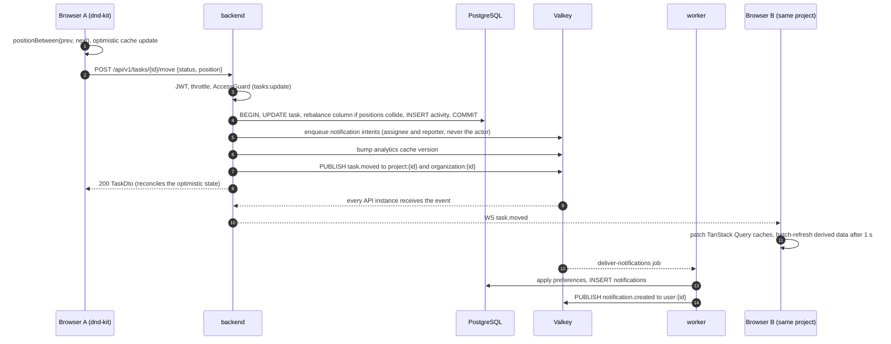

- **Fractional ordering.** The client drops the card at the midpoint between its neighbours, so a
  move normally updates a single row. When two positions come within `1e-6` of each other, the
  column is re-spaced to multiples of 1024 in **one SQL statement** (`row_number()` over the
  column). Up to 200 `task.updated` events are then broadcast for the affected cards
  ([`tasks.repository.ts`](backend/src/modules/tasks/tasks.repository.ts)).
- **Echo suppression.** Browser A ignores the broadcast of its own in-flight change; the mutation
  reconciles when it settles.

### Example 4: Comment with an @mention

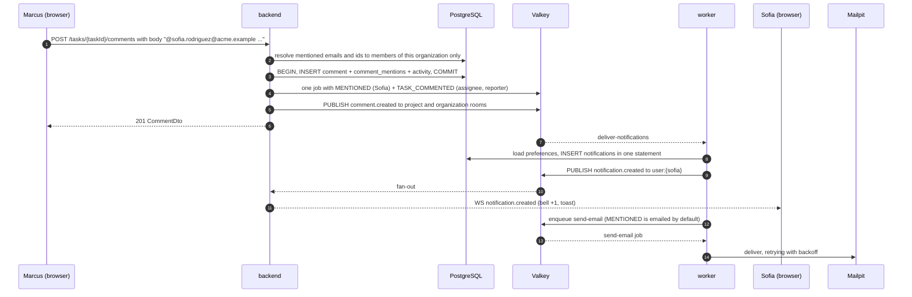

Mentions are parsed server-side ([`mentions.ts`](backend/src/modules/comments/mentions.ts)) from
`@email` tokens and from an optional `mentionedUserIds` array, and filtered to members of the
task's organization. People who are mentioned don't also receive the generic "new comment"
notification, and nobody is notified about their own action. Editing a comment notifies only
newly mentioned users.

### Example 5: File upload

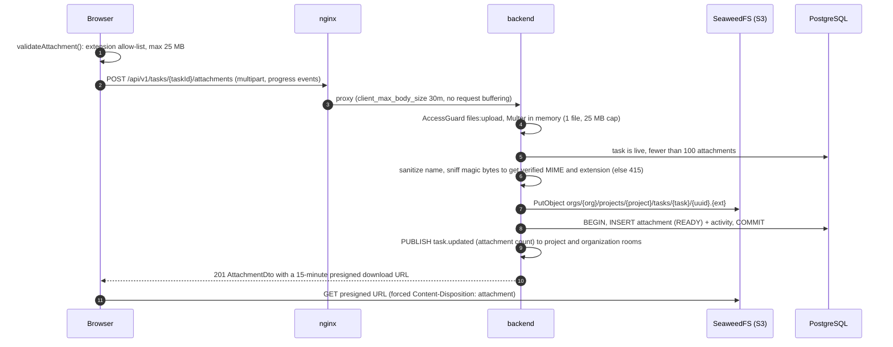

## Database design

19 Prisma models across identity, tenancy, work items, collaboration and reporting.

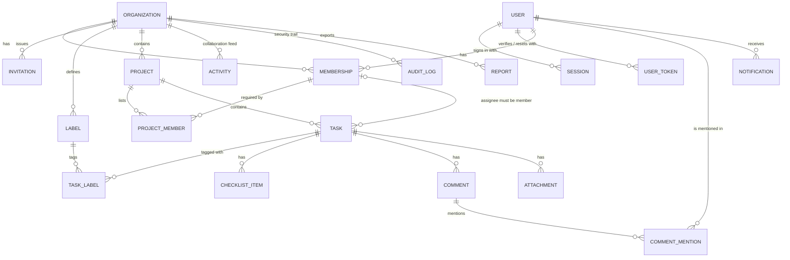

| Decision                         | Implementation                                                                                                                                                                                                                  |
| -------------------------------- | ------------------------------------------------------------------------------------------------------------------------------------------------------------------------------------------------------------------------------- |
| **Keys**                         | Time-ordered UUIDv7 primary keys: good index locality, and safe to expose in URLs.                                                                                                                                              |
| **Tenant integrity in the DB**   | `organization_id` is denormalized onto tasks, attachments, activity, task labels and project members. Children reference parents through **composite `(id, organization_id)` foreign keys**, so a row cannot point at another tenant's data. A task's assignee references `memberships(organization_id, user_id)`, so only members can be assigned. |
| **Soft delete**                  | Projects, tasks and comments have `deleted_at` and go to a 30-day trash. A project and its tasks share one deletion timestamp so they can be restored together. Deleted users are anonymized (tombstoned email), which keeps authorship intact. |
| **Partial indexes**              | List indexes use `WHERE deleted_at IS NULL`. Project keys are unique only among live projects, so deleting a project releases its key. A dedicated partial index serves the hourly due-soon scan.                            |
| **Search indexes**               | `pg_trgm` GIN indexes on `tasks.title` and `projects.name` back case-insensitive substring search.                                                                                                                              |
| **Keyset pagination**            | Activity, notification and audit feeds are ordered and indexed on `(scope, created_at DESC, id DESC)`.                                                                                                                         |
| **CHECK constraints**            | Lower-case emails, slug and project-key formats, `completed_at` set **exactly** when status is `DONE`, finite positions, non-negative sizes, due date on or after start date.                                                   |
| **Audit log**                    | `audit_logs` is append-only: a trigger rejects every `UPDATE`. Each row records actor, IP, user agent and request id.                                                                                                        |
| **Uniqueness**                   | One membership per user per organization, one invitation per organization and email, label names unique per organization, task numbers unique per project, refresh-token and user-token hashes unique. |
| **Secrets at rest**              | Refresh tokens, verification/reset tokens and invitation tokens are stored only as SHA-256 hashes.                                                                                                                            |
| **Migrations**                   | Prisma Migrate SQL files in [`prisma/migrations`](backend/prisma/migrations), applied with `migrate deploy` by the one-off `migrate` container. CI applies them to an empty database and fails on drift in both directions. |

Full reference, including per-table index rationale and transaction boundaries: [docs/database.md](docs/database.md).

## Multi-tenancy and data isolation

The **organization** is the tenant boundary. Isolation is enforced in layers, so that a mistake in
one layer is caught by another:

1. **Route-level resolution.** The global [`AccessGuard`](backend/src/common/authorization/access.guard.ts)
   inspects route params (`organizationId`, `projectId`, `taskId`, `commentId`, `attachmentId`).
   [`AccessResolver`](backend/src/common/authorization/access-resolver.service.ts) maps the
   resource to its organization and loads the caller's membership. **Non-members get `404`, never
   `403`**, so the existence of other tenants' resources isn't revealed. Callers with a missing
   permission get `403`.
2. **Fail-closed decorators.** Using `@RequirePermission` on a route without a tenant-scoped param
   throws at runtime, which prevents a permission check that silently does nothing.
3. **Tenant-aware queries.** Services filter by the resolved `organizationId` (for example
   `findFirst({ where: { id, organizationId } })`). Lists and search are always organization-scoped.
4. **Database guarantees.** Composite foreign keys make cross-tenant references impossible even if
   application code is wrong: a task can't belong to another organization's project, and a label
   from organization A can't be attached to a task in organization B.
5. **Cache hygiene.** Membership cache entries are invalidated on every join, role change or
   removal. Scope entries for soft-deleted resources are dropped, so anything in the trash is
   unreachable.
6. **Real-time channels.** Subscribing to a channel runs the same membership check. Removing a
   member publishes a `revoke` message that removes their sockets from that organization's
   channels on every API instance.
7. **Storage layout.** Object keys are prefixed with `orgs/{orgId}/`, and every attachment lookup
   is also filtered by organization.
8. **Tests.** [`isolation.e2e-spec.ts`](backend/test/integration/isolation.e2e-spec.ts) checks
   404s across tenants, refused cross-tenant writes and references, scoped lists and search, and
   WebSocket channel authorization against the real stack.

**Scope notes.** Access is organization-wide: project membership records who is on a project but
does not restrict visibility inside the organization. PostgreSQL row-level security was considered
and not enabled; the reasoning is in
[docs/database.md](docs/database.md#row-level-security-considered-not-enabled).

## Security

| Area                         | Implementation                                                                                                                                                                                                       |
| ---------------------------- | -------------------------------------------------------------------------------------------------------------------------------------------------------------------------------------------------------------------- |
| Password hashing             | Argon2id (19 MiB, 2 iterations, 1 lane; OWASP parameters), transparent re-hash on login, and a dummy verification for unknown emails to equalize timing.                                                      |
| Access tokens                | HS256 JWT, 15 minutes, issuer and audience bound, claims `{ sub, sid, typ }`. Kept in memory by the client, never in `localStorage`.                                                                            |
| Refresh tokens               | Opaque, random, stored as SHA-256 hashes. Sent in an httpOnly cookie scoped to `/api/v1/auth`, `SameSite=Lax`, `Secure` in production. Rotated on every use with reuse detection that revokes the session.          |
| Instant revocation           | Logout, password change/reset and session revocation add the session to a Valkey denylist, which is checked on every request, and close that session's WebSockets on all instances.                              |
| Brute force                  | Per-IP throttles: register 5/min, login 10/min, refresh 30/min, forgot-password and resend-verification 5 per 15 min, verify-email and reset-password 10 per 15 min. Per-account lockout after 5 failures for 15 min. |
| Account enumeration          | Forgot-password and resend-verification always return `204`. Login errors don't distinguish an unknown email from a wrong password.                                                                                  |
| Email verification           | Required before sign-in by default. Tokens are single-use: 24 hours for verification, 1 hour for password reset.                                                                                                    |
| Authorization                | Global RBAC guard with a permission table ([`permissions.ts`](backend/src/common/authorization/permissions.ts)). Users can only grant roles below their own, and never Owner.                                   |
| Tenant isolation             | See [Multi-tenancy and data isolation](#multi-tenancy-and-data-isolation).                                                                                                                                          |
| Input validation             | `class-validator` DTOs with `whitelist` and `forbidNonWhitelisted` (unknown fields rejected with `422`), UUID param pipes, and a 1 MB JSON body limit. SQL goes through Prisma, and the few raw queries use tagged-template parameters. |
| CSRF                         | Cookie-authenticated endpoints (`/auth/refresh`, `/auth/logout`) reject disallowed `Origin` headers. All other endpoints use bearer tokens.                                                                         |
| CORS                         | Explicit origin allow-list with credentials, limited methods and headers.                                                                                                                                           |
| Security headers             | The API uses helmet (HSTS in production, `no-referrer`, same-site CORP). The web container sends a CSP without inline scripts, plus `X-Frame-Options: DENY`, `nosniff`, `Permissions-Policy` and COOP.            |
| Rate limiting                | nginx: 30 req/s (burst 200) and 20 concurrent WebSocket connections per IP. API: 300 req/min per user or IP, stored in Valkey. WebSocket: 60 messages per 10 s per connection.                                   |
| File uploads                 | Extension allow-list plus magic-byte verification, 25 MB cap, 100 files per task, sanitized names, random object keys, a private bucket, and downloads forced to `attachment`.                                       |
| WebSocket                    | Origin check on connect. The token is sent in the first message, not in the URL. Authentication timeout of 10 s, per-channel authorization, 16 KB message limit, and slow consumers are dropped.                  |
| Audit logging                | Append-only `audit_logs` (enforced by a trigger) for role changes, removals, invitations, deletions and password events, with IP, user agent and request id.                                                     |
| Configuration                | Environment validated at startup. In production the process refuses an insecure cookie, the example JWT secret or the `log` mail transport.                                                                     |
| Logging                      | Secrets and personal data are redacted in structured logs. Sensitive query values are removed from logged URLs.                                                                                                    |
| Containers                   | Non-root users, read-only root filesystem for backend images, `no-new-privileges`, and production dependencies only.                                                                                                  |

Threat model, review findings and accepted risks: [docs/security.md](docs/security.md).

## Real-time architecture

**Why WebSockets.** Moves, comments and notifications need to reach other people within moments
of the write, and polling every board, drawer and badge would be wasteful and still lag. FlowSync
uses a raw WebSocket with a small JSON protocol instead of Socket.IO. The protocol stays explicit,
it is easy to authorize per channel, and the client has no transport-fallback layer.

### Fan-out across instances

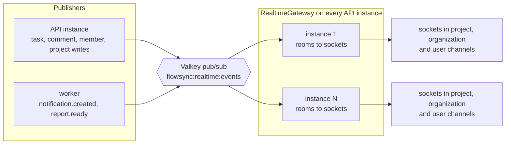

Each event is published **once**. Every API instance receives it and delivers it to its own local
sockets, and a socket subscribed to several overlapping channels receives the event only once.
Compose runs a single API instance; the pub/sub design is what allows several.

### Events

| Event                                                 | Channels                         | Published by                        |
| ----------------------------------------------------- | -------------------------------- | ----------------------------------- |
| `task.created`, `task.updated`, `task.moved`, `task.deleted` | `project:{id}`, `organization:{id}` | Task writes, comment and attachment changes (re-publish the task) |
| `comment.created`                                     | `project:{id}`, `organization:{id}` | Comments                            |
| `project.updated`                                     | `project:{id}`, `organization:{id}` | Project create, update, delete, restore |
| `member.updated`                                      | `organization:{id}` (+ `user:{id}`) | Joins, role changes, removals       |
| `notification.created`                                | `user:{id}`                      | Worker (notification delivery)      |
| `report.ready`                                        | `user:{id}`                      | Worker (CSV reports; no UI handler yet) |

### Connection lifecycle

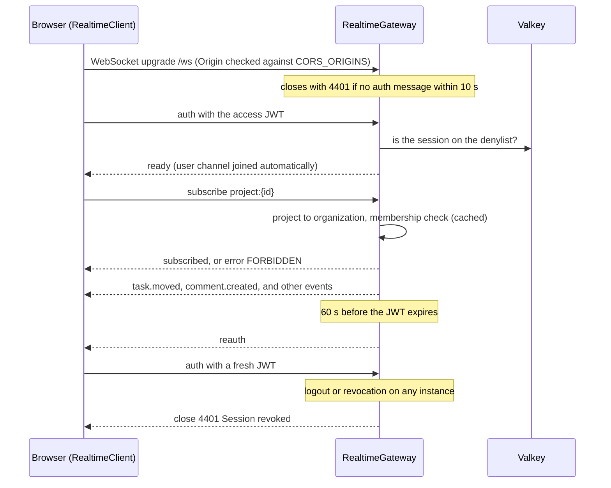

**Guarantees and limits.** Delivery is best-effort and at-most-once, with no replay. The client
compensates by refetching on-screen queries after every reconnect. Server-side limits: 30-second
heartbeat pings (dead sockets are terminated), 50 channels per connection, 60 inbound messages per
10 seconds (close code `4429`), 16 KB maximum message size, and connections with more than 1 MB
buffered are dropped rather than buffered without bound.

**Client behaviour** ([`lib/realtime/client.ts`](frontend/src/lib/realtime/client.ts)). Reconnects
with exponential backoff and jitter, re-subscribes to its channels, answers `reauth` in place, and
refreshes the session if the socket's token expired (for example after a laptop sleeps). Event
handlers patch TanStack Query caches directly and batch refreshes of derived data (analytics,
project progress) into one pass per second.

Protocol reference: [docs/realtime.md](docs/realtime.md).

## Background worker architecture

**Why a separate worker.** Email delivery, notification fan-out, CSV generation and cleanup are
slow, can fail transiently, and in some cases run on a schedule. Running them in their own process
keeps request latency independent of SMTP or bulk queries, lets failed work retry without user
involvement, and lets the worker scale separately from the API.

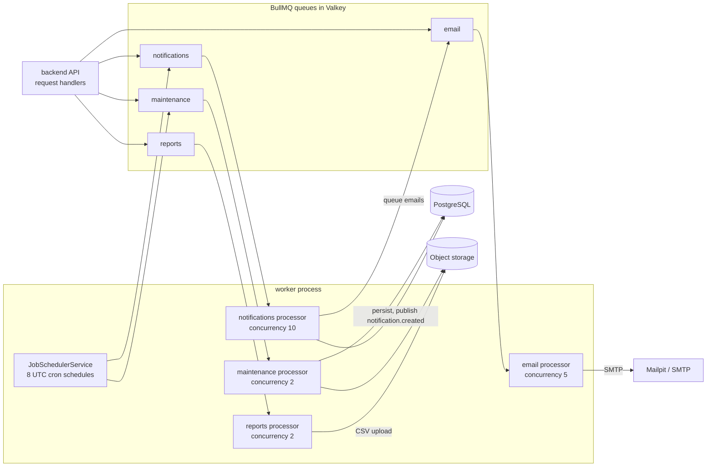

| Queue           | Jobs                                                                                                            | Retry policy                  | Retention                                   |
| --------------- | --------------------------------------------------------------------------------------------------------------- | ----------------------------- | ------------------------------------------- |
| `notifications` | `deliver-notifications`, `scan-due-soon` (hourly at :05)                                                        | 5 attempts, exponential from 2 s  | completed 1 day / 1 000 jobs, failed 7 days |
| `email`         | `send-email` (verification, reset, invitation, notification)                                                    | 6 attempts, exponential from 10 s | removed on success, failed kept 1 day (payloads contain one-time links) |
| `reports`       | `generate-report` (CSV to object storage, then `report.ready`)                                                  | 3 attempts, exponential from 15 s | completed 1 day, failed 7 days              |
| `maintenance`   | Expired sessions and tokens, old notifications, stale pending uploads (hourly), old reports, 30-day trash purge, audit-log retention (365 days), storage deletions | 3 attempts, exponential from 60 s | completed 1 day, failed 7 days              |

- **Idempotent scheduling.** Every worker registers its schedules at startup with
  `upsertJobScheduler`, so running several workers does not create duplicate schedules.
- **Safe retries.** Notification persistence is the only step that can throw, so a retried job
  doesn't create duplicates. Due-date reminders are de-duplicated with a `SET NX` marker per task
  and date. Report jobs use a deterministic `jobId`.
- **Producer behaviour.** Handlers enqueue side effects **after** their transaction commits, with a
  3-second timeout. A failed enqueue is logged and never fails the user's request (see
  [Known limitations](#known-limitations)).
- **Local convenience.** Setting `RUN_WORKERS_IN_API=true` runs the processors inside the API
  process for `npm run start:dev`. Compose runs a dedicated `worker` container instead.

## File storage architecture

```text
Browser ──multipart──▶ nginx ──▶ backend ──PutObject──▶ SeaweedFS / S3 (private bucket)
                                   │
                                   └──▶ PostgreSQL: attachments row (name, verified MIME, size, key, status)
Browser ◀──── presigned GET (15 min, Content-Disposition: attachment) ──── SeaweedFS / S3
```

- **Metadata vs. bytes.** PostgreSQL stores only metadata and the object key, never file contents.
- **Key layout** ([`storage-keys.ts`](backend/src/infrastructure/storage/storage-keys.ts)):
  `orgs/{org}/projects/{project}/tasks/{task}/{uuid}.{ext}`, `orgs/{org}/reports/{id}.csv` and
  `avatars/{user}/{uuid}.{ext}`. The random component prevents key enumeration, and the extension
  comes from the verified type, not from the uploaded name.
- **Web client upload path.** The upload goes through the API as multipart form data. Multer holds
  it in memory, capped at 25 MB.
- **Direct-upload path (API only).** `POST /tasks/{id}/attachments/upload-url` reserves a `PENDING`
  row and returns a presigned `PUT`. `POST /attachments/{id}/complete` then checks the stored size
  (`HEAD`) and sniffs the first bytes (ranged `GET`) before marking the file `READY`. On a mismatch
  the object is deleted. Pending uploads older than a day are cleaned up hourly.
- **Deletion** removes the row immediately and deletes the object asynchronously through the
  maintenance queue. Organization, project and task purges delete by prefix.
- **Avatars** go through `/users/{id}/avatar`, which redirects to a presigned URL.
- **Local setup.** SeaweedFS provides the S3 API. Outside production the API creates the bucket on
  startup, and `S3_PUBLIC_ENDPOINT` makes presigned URLs reachable from the browser.

## API documentation

With the stack running:

| URL                                       | What                                                                        |
| ----------------------------------------- | --------------------------------------------------------------------------- |
| http://localhost:4000/api/v1/docs         | Swagger UI, 98 operations in 14 tags                                        |
| http://localhost:4000/api/v1/docs-json    | OpenAPI 3.0 document                                                        |
| http://localhost:4000/health              | Readiness: API, PostgreSQL and Valkey status with latencies (`503` if down) |
| http://localhost:4000/health/live         | Liveness                                                                    |

The Swagger description covers the authentication flow (bearer access token plus refresh cookie),
roles, the error format, pagination conventions and the WebSocket protocol. Swagger is on by
default outside production and must be enabled explicitly in production (`SWAGGER_ENABLED`).
[`api-docs.e2e-spec.ts`](backend/test/integration/api-docs.e2e-spec.ts) fails the build if an
operation lacks a summary, tag, success response or bearer declaration, or if the documented
public surface differs from what the API actually allows.

## Tech stack

| Layer          | Technology                                                                                           | Purpose                                                        |
| -------------- | ---------------------------------------------------------------------------------------------------- | -------------------------------------------------------------- |
| Frontend       | React 19, TypeScript 5.9, Vite 8, React Router 7, Tailwind CSS 4                                     | SPA, routing with lazy-loaded routes, styling                  |
| Frontend state | TanStack Query 5, Zustand 5, Axios                                                                   | Server-state cache, client state, HTTP with refresh handling   |
| Frontend UI    | React Hook Form + Zod, dnd-kit, Recharts, lucide-react                                               | Forms and validation, accessible drag and drop, charts, icons  |
| Backend        | Node.js 22, NestJS 12, TypeScript 6                                                                  | Modular API and worker                                         |
| Auth           | Passport JWT, `@nestjs/jwt`, argon2                                                                  | Access tokens, password hashing                                |
| Validation     | class-validator, class-transformer                                                                   | DTO and environment validation                                 |
| Database       | PostgreSQL 18 (`pg_trgm`)                                                                            | Relational source of truth, trigram search indexes             |
| ORM            | Prisma 7 with `@prisma/adapter-pg`                                                                   | Typed queries, migrations, seed                                |
| Cache / queues | Valkey 8 (Redis API), ioredis, BullMQ, `@nestjs/throttler`                                           | Queues, pub/sub, caching, distributed rate limits              |
| Real-time      | `ws` through `@nestjs/platform-ws`                                                                   | WebSocket gateway                                              |
| Object storage | SeaweedFS (S3 API), AWS SDK v3 (`client-s3`, `s3-request-presigner`)                                 | Attachments, avatars, reports; presigned URLs                  |
| Worker         | BullMQ processors in a separate Nest application context                                            | Notifications, email, reports, maintenance                     |
| Email          | Nodemailer (SMTP), Mailpit locally                                                                   | Transactional and notification email                           |
| Observability  | pino / nestjs-pino, health endpoints                                                                 | Structured logs with request correlation, probes               |
| API docs       | `@nestjs/swagger`                                                                                    | OpenAPI 3 document and Swagger UI                              |
| Testing        | Vitest 5, Testing Library, jsdom, Supertest, `@vitest/coverage-v8`                                   | Unit, component and integration tests                          |
| Infrastructure | Docker (multi-stage), Docker Compose, nginx-unprivileged, GitHub Actions                             | Images, local stack, reverse proxy, CI                         |

## Project structure

```text
TeamSync/
├── backend/                     NestJS API, WebSocket gateway and worker (one codebase, three images)
│   ├── src/
│   │   ├── main.ts              API entry point (HTTP + WebSocket)
│   │   ├── worker.ts            Worker entry point (queues + health server on :4001)
│   │   ├── app.module.ts        API composition root and global guards
│   │   ├── worker.module.ts     Worker composition root (shares CORE_IMPORTS)
│   │   ├── bootstrap/           HTTP pipeline (helmet, CORS, limits, validation, errors) and Swagger
│   │   ├── config/              Environment validation and typed AppConfig
│   │   ├── common/              Auth decorators, RBAC (permissions, AccessGuard, AccessResolver), errors, pipes
│   │   ├── infrastructure/      Prisma, Redis (cache, throttler storage), BullMQ producers, S3, mail, logger
│   │   └── modules/             auth · users · organizations · projects · tasks · comments · labels · files ·
│   │                            notifications · activity · audit · analytics · search · realtime · jobs · health
│   ├── prisma/                  schema.prisma, migrations/, seed.ts
│   ├── test/integration/        Integration tests against real PostgreSQL, Valkey and S3
│   └── Dockerfile               Multi-stage build: api · worker · migrate targets
├── frontend/                    React SPA
│   ├── src/
│   │   ├── app/                 Router, providers, query client
│   │   ├── features/            auth · dashboard · projects · tasks · comments · notifications · search ·
│   │   │                        team · organizations · settings · activity
│   │   ├── lib/                 HTTP client, real-time client, permissions, env
│   │   ├── services/            Typed API clients
│   │   ├── store/               Zustand stores
│   │   └── components/          UI kit, charts, shared components
│   ├── nginx/                   nginx templates: SPA, /api + /ws proxy, CSP and security headers
│   └── Dockerfile               Vite build served by nginx-unprivileged
├── docs/                        architecture · database · realtime · security · deployment · screenshots
├── .github/workflows/ci.yml     CI pipeline
├── docker-compose.yml           Full local stack
└── .env.example                 Optional compose overrides (host ports, JWT secret)
```

## Local development

### Prerequisites

- **Docker Desktop** (or Docker Engine) with **Compose v2**. This is all you need for the full stack.
- **Node.js ≥ 22.12 and npm**, only for running the API or web client from source, or the test
  suites. Both packages declare `"engines": { "node": ">=22.12.0" }`, and the images use `node:22-alpine`.
- Free host ports 8080, 4000, 5432, 6379, 9000, 1025 and 8025. Each can be overridden in `.env`.

### 1. Clone

```bash
git clone <YOUR_REPOSITORY_URL>
cd TeamSync
```

### 2. Environment

- **Docker stack:** no `.env` file is required. Container settings are defined in
  [`docker-compose.yml`](docker-compose.yml) with local-only defaults. To change host ports or set
  your own signing secret, copy the optional overrides:

  ```bash
  cp .env.example .env
  # then e.g. WEB_PORT=8081 or JWT_ACCESS_SECRET=<at least 32 random characters>
  ```

- **Running from source:** copy [`backend/.env.example`](backend/.env.example) to `backend/.env`.
  The web client needs no env file: [`frontend/.env.development`](frontend/.env.development)
  contains only public defaults, and every `VITE_` variable ends up in the browser bundle, so it
  must never hold secrets.
- `.env` files are git-ignored. Never commit real credentials.

### 3. Start the stack

```bash
docker compose up -d --build
```

Compose starts PostgreSQL, Valkey, SeaweedFS and Mailpit, waits until they are healthy, runs
`migrate`, then starts `backend` and `worker`, and finally `frontend`.

### 4. Verify

```bash
docker compose ps        # every service "healthy"
docker compose ps -a     # also shows the one-off migrate container: "Exited (0)"
```

### 5. Load demo data (optional)

```bash
docker compose run --rm -e NODE_ENV=development migrate prisma db seed
```

The migrate image runs with `NODE_ENV=production`, and the seed refuses to run against production,
hence the override. The seed is idempotent: it does nothing if the demo user already exists.

### 6. Open the application

```text
Web app:        http://localhost:8080
API:            http://localhost:4000/api/v1
Swagger UI:     http://localhost:4000/api/v1/docs
Health:         http://localhost:4000/health
Mailpit:        http://localhost:8025
S3 API:         http://localhost:9000   (SeaweedFS, used by presigned URLs)
```

Logs: `docker compose logs -f backend worker` (structured JSON). Stop with `docker compose down`,
or `docker compose down -v` to also delete the data volumes.

### Running the API and web client from source (hot reload)

```bash
# Infrastructure only. If the full stack is running, stop the app containers first,
# because they hold ports 8080 and 4000: docker compose stop frontend backend worker
docker compose up -d postgres redis s3 mailpit

cd backend
cp .env.example .env
npm install
npm run prisma:deploy     # apply migrations
npm run db:seed           # optional demo data
npm run start:dev         # http://localhost:4000, workers run in-process (RUN_WORKERS_IN_API=true)

cd ../frontend
npm install
npm run dev               # http://localhost:5173, proxies /api and /ws to :4000
```

To run the worker as its own process, set `RUN_WORKERS_IN_API=false` and run
`npm run start:worker:dev`. The backend builds with plain `tsc`, and `scripts/dev.mjs` runs
`tsc --watch` together with `node --watch`; the Nest CLI is not used.

## Demo credentials

> **Local development/demo credentials only. Never use these credentials in production.**
> They are created by [`prisma/seed.ts`](backend/prisma/seed.ts), which refuses to run when
> `NODE_ENV=production`.

| Email                          | Password       | Role                                            |
| ------------------------------ | -------------- | ----------------------------------------------- |
| `demo@flowsync.dev`            | `Password123!` | Owner of **Acme Inc.**, Member of **Northwind Labs** |
| `priya.sharma@acme.example`    | `Password123!` | Admin (Acme)                                    |
| `marcus.chen@acme.example`     | `Password123!` | Manager (Acme)                                  |
| `sofia.rodriguez@acme.example` | `Password123!` | Member (Acme)                                   |
| `olivia.brown@acme.example`    | `Password123!` | Viewer (Acme), read-only                        |
| `pending@flowsync.dev`         | `Password123!` | Unverified; shows the "verify your email" block |

Teammates use the reserved `.example` domain, so no email can reach a real inbox; everything
appears in Mailpit. Sign-in is limited to 10 attempts per minute per IP, and an account locks for
15 minutes after 5 failed attempts.

## Testing

| Suite               | Command                                  | What it covers                                                                                                                   | Last verified run          |
| ------------------- | ---------------------------------------- | -------------------------------------------------------------------------------------------------------------------------------- | -------------------------- |
| Backend unit        | `cd backend && npm test`                 | Auth and sessions, token service, RBAC and access resolution, task creation and moves, notification delivery, WebSocket gateway, env validation, logging, utilities | 16 files, **98 tests** passed |
| Backend integration | `cd backend && npm run test:integration` | The real Nest app against PostgreSQL, Valkey and S3: auth flows, role enforcement, tasks and board moves, notifications via the worker, tenant isolation, upload validation, WebSocket channels, API docs | 4 files, **37 tests** passed  |
| Frontend            | `cd frontend && npm test`                | Login page, HTTP/refresh layer, real-time client, Kanban board and task card, board utilities, create-task modal, permissions, route guard, schemas | 11 files, **43 tests** passed |

Counts are from local runs on 2026-09-27. CI runs the same commands on every pull request.

**Integration test setup.** Start the dependencies with `docker compose up -d postgres redis s3`.
Each run creates a throwaway database (applying every migration with `migrate deploy`, exactly
like a release) and a throwaway bucket, uses Valkey logical database 9, and removes everything
afterwards. Override the targets with the `INTEGRATION_DATABASE_URL`, `INTEGRATION_REDIS_URL` and
`INTEGRATION_S3_*` variables.

**Other checks** (available in both `backend/` and `frontend/`):

```bash
npm run lint           # ESLint, zero warnings allowed
npm run typecheck      # tsc
npm run format:check   # Prettier
npm run test:cov       # tests with V8 coverage
npm run build          # production build
```

**Continuous integration** ([`.github/workflows/ci.yml`](.github/workflows/ci.yml)):

| Job                  | Steps                                                                                                                                                         |
| -------------------- | ------------------------------------------------------------------------------------------------------------------------------------------------------------- |
| Backend              | format, lint, typecheck, unit tests with coverage, build                                                                                                      |
| Backend integration  | start PostgreSQL/Valkey/S3 → `prisma validate` → `migrate deploy` on an empty DB → **drift check** (migrations ↔ schema ↔ database) → seed twice (idempotency) → integration tests |
| Frontend             | format, lint, typecheck, tests with coverage, build, bundle-size report                                                                                       |
| Docker (`main` only) | build all four images → full-stack smoke test (`/healthz`, `401` on `/auth/me`, `/health` OK, CSP header present) → optional push to GHCR. Nothing is deployed. |

## Docker services

From [`docker-compose.yml`](docker-compose.yml) (host ports can be overridden in `.env`):

| Service    | Image                                  | Responsibility                                                   | Host port(s)             |
| ---------- | -------------------------------------- | ---------------------------------------------------------------- | ------------------------ |
| `frontend` | `flowsync-web:local` (nginx-unprivileged) | SPA, `/api` + `/ws` reverse proxy, CSP, edge rate limits      | 8080                     |
| `backend`  | `flowsync-api:local`                   | REST API + WebSocket gateway                                     | 4000                     |
| `worker`   | `flowsync-worker:local`                | BullMQ processors and schedulers (health on 4001)                | internal only            |
| `migrate`  | `flowsync-migrate:local`               | One-off `prisma migrate deploy`, then exits                      | none                     |
| `postgres` | `postgres:18-alpine`                   | Primary database                                                 | 5432                     |
| `redis`    | `valkey/valkey:8-alpine`               | Queues, pub/sub, cache, rate limits (AOF on, `noeviction`)       | 6379                     |
| `s3`       | `chrislusf/seaweedfs:4.47`             | S3-compatible object storage                                     | 9000                     |
| `mailpit`  | `axllent/mailpit:v1.31.2`              | SMTP catcher and web UI                                          | 1025 (SMTP), 8025 (UI)   |

Every long-running service has a health check, and dependants start only once their dependencies
are healthy. The backend and worker run with `read_only: true`, `tmpfs: /tmp`, `init: true` and
`no-new-privileges`. Data is kept in the `postgres-data`, `redis-data` and `s3-data` volumes. The
containers run the production images with `NODE_ENV=development` (plain-HTTP cookies, automatic
bucket creation); production settings are in [docs/deployment.md](docs/deployment.md).

## Engineering highlights

- **Modular monolith plus a worker process.** One codebase and schema with real transactions,
  while slow and retryable work runs in its own process and can't hurt request latency.
- **Secure-by-default authorization.** Global guards mean a new route is authenticated and
  tenant-checked without anyone remembering to add a decorator.
- **Tenant isolation in two layers.** Application checks return `404` across tenants, and
  composite foreign keys make cross-tenant references impossible even when the code is wrong.
- **Commit first, then side effects.** Notifications, email and real-time events never fail or
  slow a committed write.
- **Horizontal real-time fan-out.** Redis pub/sub plus per-instance rooms mean any API instance can
  serve any socket.
- **Credentials that can't outlive revocation.** Rotating refresh tokens with reuse detection, a
  short-lived denylist and socket re-authentication together give immediate logout without a
  database lookup per request.
- **Fractional ordering with an O(1) rebalance.** A board move normally updates one row; when
  float precision runs out, one SQL statement re-spaces the column.
- **Database-enforced invariants.** CHECK constraints (`completed_at` is set exactly when a task is
  `DONE`), an append-only audit-log trigger, and partial unique indexes with soft delete keep data
  valid regardless of which code path writes it.
- **Index design driven by the queries.** Partial indexes for live rows, trigram GIN for search, a
  dedicated partial index for the reminder scan, and keyset pagination for feeds.
- **Content-verified uploads.** Magic-byte sniffing and forced downloads protect users from
  disguised or inline-rendering files.
- **Idempotent schedules and jobs.** `upsertJobScheduler`, `SET NX` reminder markers and
  deterministic job ids make it safe to run more than one worker.
- **Fail-fast configuration.** The process won't start in production with an insecure cookie, the
  example secret or a logging-only mail transport.
- **Hardened, reproducible images.** Multi-stage builds, non-root users, read-only filesystems,
  health checks, and one backend Dockerfile with `api`, `worker` and `migrate` targets.
- **Tests against real infrastructure.** Integration tests boot the actual application against
  PostgreSQL, Valkey and S3, and CI checks migrations for drift.

## Scalability considerations

### Currently implemented

These are design properties present in the code. They have not been load-tested, and compose runs
one instance of each service.

- **Stateless API processes.** Sessions live in PostgreSQL; caches, rate-limit counters and the
  revocation denylist live in Valkey; real-time events fan out through pub/sub. Nothing needed for
  correctness sits in process memory.
- **Independent worker scaling.** Workers are separate processes with per-queue concurrency and
  idempotent schedule registration.
- **Query efficiency.** Index-backed lists, SQL-side analytics aggregation with per-organization
  cache versioning, cached authorization lookups, and bounded responses (paginated lists, cursor
  feeds, a 5,000-task board cap, 1 MB bodies).
- **Direct file transfer.** Downloads bypass the API through presigned URLs, and an API-only
  presigned upload flow exists for large or direct uploads.
- **Backpressure.** nginx edge limits, per-user API throttles, WebSocket message budgets and
  slow-consumer eviction.

### Potential production scaling (not implemented)

- **Load balancing** across several API instances, with WebSocket upgrade support. Sticky sessions
  are not required by the design.
- **PostgreSQL:** a connection pooler (e.g. PgBouncer), read replicas for analytics and search,
  and partitioning or archiving of `activities` and `notifications` as they grow.
- **Valkey:** separate instances for queues and for cache/pub-sub, and sharded pub/sub or a
  dedicated broker once every-instance fan-out becomes the bottleneck.
- **Object storage and CDN:** managed S3 with lifecycle rules, and a CDN in front of the static SPA.
- **Workers:** autoscaling per queue based on queue depth.
- **Search:** PostgreSQL full-text search with ranking, or a dedicated search engine.
- **Reliability:** a transactional outbox so side effects survive a broker outage.
- **Observability:** metrics, tracing and alerting (see below).

## Observability and reliability

| Implemented                                                                                                                                         |
| --------------------------------------------------------------------------------------------------------------------------------------------------- |
| **Structured JSON logs** (pino) from every process, tagged with `service`, `env` and `version`, with secrets and personal data redacted.            |
| **Request correlation.** The client sends `X-Request-Id`; the API reuses or mints one, returns it, includes it in error bodies, completion logs (with `durationMs`, `userId`, `organizationId`) and audit-log rows. |
| **Job logging** with queue, job id, attempt number and duration. Final failures are logged as errors and kept in Valkey for inspection.             |
| **Health probes.** API `/health` (PostgreSQL + Valkey, 2-second timeout per check) and `/health/live`; the same on the worker's port 4001; nginx `/healthz`. The web, API and worker images declare a `HEALTHCHECK`. |
| **Graceful shutdown.** Nest shutdown hooks; the gateway closes sockets with code `1001`; the worker closes its health server on `SIGTERM`.           |
| **Degraded modes.** Valkey outages fail open for caching, rate limiting and revocation; enqueue timeouts protect requests; real-time falls back to local delivery. |
| **Retries** with exponential backoff on every queue.                                                                                                 |
| **Data integrity** through transactions, foreign keys, CHECK constraints and the append-only audit trigger.                                        |

**Not implemented:** metrics (e.g. Prometheus), distributed tracing (e.g. OpenTelemetry), error
tracking (e.g. Sentry) and alerting.

## Screenshots

Captured from a local stack with the seeded demo data.

| Dashboard                                          | Kanban board                                |
| -------------------------------------------------- | ------------------------------------------- |
| 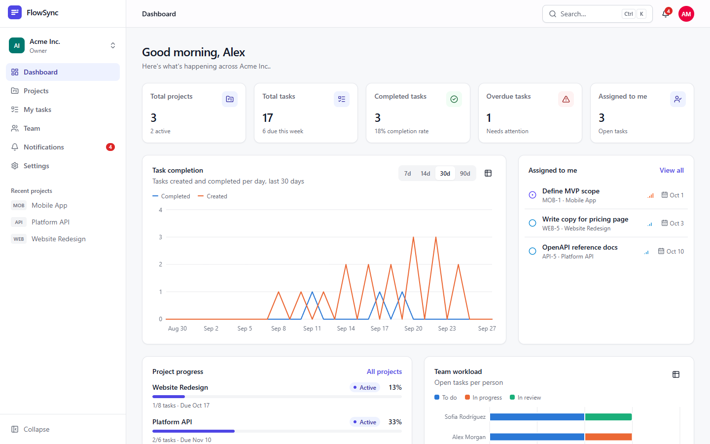       |  |
| **Task details**                                   | **Project analytics**                       |
| 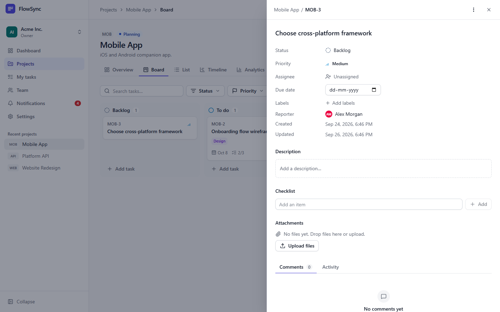 | 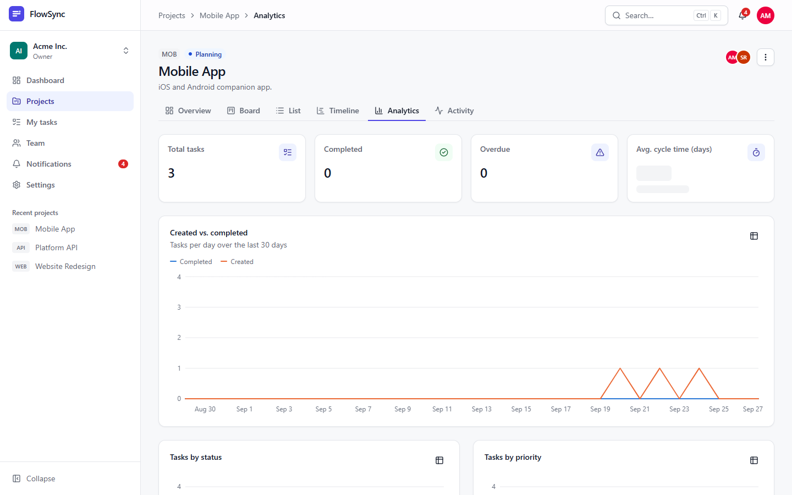 |

<details>
<summary>Sign-in</summary>

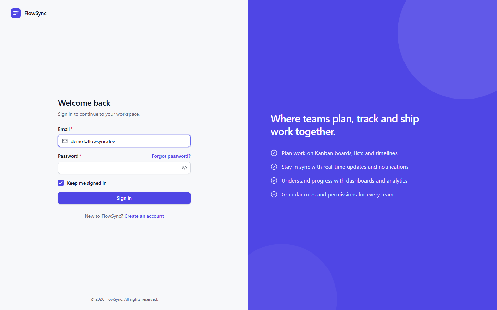

</details>

## Interview talking points

Discussion topics grounded in this codebase, with where to look:

1. **Why PostgreSQL rather than a document store?** The data is highly relational (tenants,
   memberships, tasks, labels) and tenant safety relies on composite foreign keys and CHECK
   constraints. → [`schema.prisma`](backend/prisma/schema.prisma), migrations.
2. **How is tenant isolation enforced, and why 404 rather than 403?** →
   [`access.guard.ts`](backend/src/common/authorization/access.guard.ts),
   [`access-resolver.service.ts`](backend/src/common/authorization/access-resolver.service.ts).
3. **What happens to cached memberships when a user is removed?** Cache invalidation, the socket
   `revoke` message, and the staleness window.
4. **How does real-time sync work across several API instances, and how would you scale it to
   10,000+ concurrent sockets?** → [`realtime.gateway.ts`](backend/src/modules/realtime/realtime.gateway.ts).
5. **At-most-once events: what does the client do about missed events?** Refetch on reconnect,
   echo suppression, and the trade-offs of adding replay.
6. **Refresh-token rotation and reuse detection:** the grace window for parallel tabs and the
   compare-and-swap update. → [`sessions.service.ts`](backend/src/modules/auth/sessions.service.ts).
7. **How is logout made immediate with stateless JWTs?** The denylist TTL and failing open when
   Valkey is down.
8. **Fractional positions:** why floats, when to rebalance, and how concurrent moves interact.
9. **Why separate the worker from the API, and what would you change to guarantee delivery?** Enqueue
   after commit versus a transactional outbox.
10. **Preventing duplicate background work:** idempotent schedulers, `SET NX` markers,
    deterministic job ids, and retry-safe persistence.
11. **Upload security:** why sniff content, why force `attachment`, and when to switch the client
    to presigned direct uploads.
12. **Evolving the schema safely:** expand-and-contract migrations with `migrate deploy` in a
    one-off job, and CI drift checks.
13. **Improving observability:** where metrics and traces would add the most value (queue depth,
    WebSocket fan-out latency, slow queries).

## Known limitations

These are stated plainly so that nothing in this README over-claims:

- **@mentions UI.** The API fully supports mentions, but the comment box has no autocomplete, and
  mentions aren't highlighted when a comment is displayed. You mention someone by typing
  `@their.email@example.com`.
- **Timeline view** is a placeholder that lists open tasks by due date, not a Gantt chart.
- **API-only features:** CSV reports, the audit-log viewer, trash restore, label management,
  ownership transfer, account deletion, presigned direct uploads, and the extended analytics
  endpoints. All are implemented and documented in Swagger but have no screens yet.
- **Access control is organization-wide.** Project membership does not restrict what other members
  of the organization can see.
- **Side effects are best-effort.** Notifications, emails and real-time events are enqueued after
  commit without a transactional outbox, so a Valkey outage at that moment can drop one (it is
  logged).
- **Real-time delivery has no replay.** Clients recover by refetching after a reconnect.
- **Search** is case-insensitive substring matching backed by trigram indexes, not ranked
  full-text search.
- **No deployment target.** CI builds and smoke-tests images, but there are no Kubernetes or
  Terraform manifests, and nothing is deployed automatically.
- **No committed browser end-to-end suite** (e.g. Playwright).

## Future improvements

- UI for the API-only features above, starting with trash restore, label management and CSV exports.
- A mention autocomplete in the comment composer, with highlighted mentions.
- Project-level permissions (private projects).
- A transactional outbox for notifications and events.
- A browser end-to-end suite in CI.
- Metrics, tracing and alerting.
- A deployment pipeline (container registry, then a managed platform) with migrations as a
  pre-deploy step.
- Ranked full-text search.
- A Gantt timeline.

## Further documentation

| Document                                                      | Contents                                                                     |
| ------------------------------------------------------------- | ---------------------------------------------------------------------------- |
| [Architecture](docs/architecture.md)                          | Components, request lifecycle, write path, jobs, performance, failure modes  |
| [Database](docs/database.md)                                  | Data model, constraints, tenant isolation, indexes, transactions, migrations |
| [Real-time](docs/realtime.md)                                 | WebSocket protocol, channels, auth lifecycle, fan-out, delivery guarantees   |
| [Security](docs/security.md)                                  | Trust boundaries, controls, review findings, accepted risks, checklist      |
| [Deployment](docs/deployment.md)                              | Images, configuration, release procedure, probes, scaling, CI/CD, backups    |
| [Backend](backend/README.md) · [Frontend](frontend/README.md) | Package-level guides                                                         |

## License

No license file has been published for this repository yet, and the backend package is marked
`UNLICENSED`. Until a license is added, all rights are reserved by the author.
