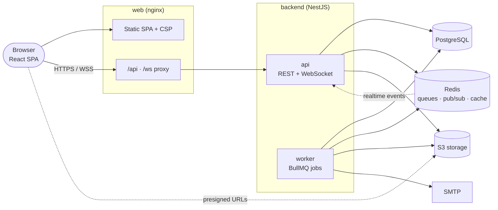

# FlowSync

**Real-time collaborative work management** — organizations, projects, Kanban boards, comments,
files, notifications and analytics, with live updates across every open browser.

FlowSync is a multi-tenant web application: a React single-page app, a NestJS API with a
WebSocket gateway, and background workers, backed by PostgreSQL, Redis and S3-compatible object
storage. It ships as four container images and runs locally with one `docker compose` command.

---

## Contents

[Features](#features) · [Screenshots](#screenshots) · [Architecture](#architecture) ·
[Tech stack](#tech-stack) · [Repository structure](#repository-structure) ·
[Quick start (Docker)](#quick-start-docker) · [Local development](#local-development) ·
[Environment variables](#environment-variables) · [Database](#database) · [Redis](#redis) ·
[Background workers](#background-workers) · [Testing](#testing) · [Docker](#docker) ·
[Deployment](#deployment) · [API documentation](#api-documentation) · [Documentation](#documentation)

---

## Features

- **Workspaces & teams** — organizations with roles (Owner, Admin, Manager, Member, Viewer),
  email invitations, ownership transfer, member profiles and workload.
- **Projects & Kanban boards** — drag-and-drop boards (mouse, touch and keyboard), list and
  timeline views, filters (status, priority, assignee, labels, due dates), task identifiers
  (`WEB-42`), checklists, labels, due dates, 30-day trash with restore.
- **Collaboration** — comments with `@mentions`, attachments (content-verified, private storage),
  activity history per task/project/organization.
- **Real time** — boards, comments, notifications and membership changes update live over
  WebSockets; the client recovers from disconnects automatically.
- **Notifications** — in-app and email, per-type preferences, due-date reminders.
- **Analytics** — dashboard, completion trends, team workload, project progress, CSV exports.
- **Search** — organization-wide search across projects, tasks and people (`Ctrl K`).
- **Security** — Argon2id passwords, rotating refresh tokens with theft detection, instant
  session revocation, email verification, account lockout, strict tenant isolation enforced in the
  API _and_ the database, audit log, CSP, rate limiting. See [docs/security.md](docs/security.md).
- **Operations** — structured JSON logs with request/user/organization ids, health probes,
  graceful shutdown, container images, CI with integration tests.

## Screenshots

Captured from a local stack with the seeded demo data.

| Dashboard                                          | Kanban board                                 |
| -------------------------------------------------- | -------------------------------------------- |
|        |   |
| **Task details**                                   | **Project analytics**                        |
|  |  |

<details>
<summary>Sign-in</summary>


</details>

## Architecture



- The browser uses one origin: nginx serves the SPA and proxies `/api` and `/ws` to the API.
- The API is stateless; writes commit in PostgreSQL transactions, then enqueue side effects
  (notifications, email) to BullMQ and publish real-time events through Redis pub/sub, which every
  API instance fans out to its WebSocket clients.
- Workers process queues and scheduled maintenance; a one-off `migrate` job applies database
  migrations before each release.

Details: [docs/architecture.md](docs/architecture.md).

## Tech stack

| Layer         | Technologies                                                                                                                      |
| ------------- | --------------------------------------------------------------------------------------------------------------------------------- |
| Web client    | React 19, TypeScript, Vite 8, React Router 7, TanStack Query 5, Zustand, React Hook Form + Zod, dnd-kit, Recharts, Tailwind CSS 4 |
| API & workers | Node.js 22, NestJS 12, TypeScript, Prisma 7, Passport JWT, class-validator, BullMQ, `ws`, pino, Swagger/OpenAPI                   |
| Data          | PostgreSQL (18 locally), Redis ≥ 6.2 / Valkey, S3-compatible object storage (SeaweedFS locally)                                   |
| Testing       | Vitest, Testing Library, jsdom, Supertest, real PostgreSQL/Redis/S3 integration tests                                             |
| Delivery      | Docker (multi-stage, non-root), docker compose, nginx, GitHub Actions                                                             |

## Repository structure

```
.
├── backend/                 NestJS API, WebSocket gateway, workers, Prisma schema & migrations
│   ├── src/                 bootstrap · config · common · infrastructure · modules/*
│   ├── prisma/              schema.prisma, migrations/, seed.ts
│   ├── test/integration/    API integration tests (real services)
│   └── Dockerfile           targets: api · worker · migrate
├── frontend/                React web client
│   ├── src/                 app · features/* · components · lib · services · store
│   ├── nginx/               production nginx config (SPA, proxy, security headers)
│   └── Dockerfile           nginx image with the built SPA
├── docs/                    architecture · database · realtime · deployment · security · screenshots
├── .github/workflows/       CI pipeline
├── docker-compose.yml       complete local stack with health checks
└── .env.example             optional compose overrides (ports, JWT secret)
```

## Quick start (Docker)

**Prerequisites:** Docker with Compose v2.

```bash
docker compose up -d --build
docker compose run --rm -e NODE_ENV=development migrate prisma db seed   # optional demo data
```

| URL                               | What                                                           |
| --------------------------------- | -------------------------------------------------------------- |
| http://localhost:8080             | Web client — sign in with `demo@flowsync.dev` / `Password123!` |
| http://localhost:4000/api/v1/docs | Swagger UI                                                     |
| http://localhost:8025             | Mailpit — every email the app sends                            |

`docker compose ps` should show every service `healthy` and `migrate` exited with code 0. Ports can
be changed in a root `.env` (see [`.env.example`](.env.example)). Stop with `docker compose down`
(add `-v` to delete the data).

## Local development

Run the infrastructure in Docker and the API and web client from source (hot reload):

```bash
docker compose up -d postgres redis s3 mailpit

# API — http://localhost:4000 (workers run in-process)
cd backend
cp .env.example .env
npm install
npm run prisma:deploy
npm run db:seed          # optional demo data
npm run start:dev

# Web client — http://localhost:5173 (proxies /api and /ws to :4000)
cd ../frontend
npm install
npm run dev
```

Requires Node.js ≥ 22.12. Package guides: [backend/README.md](backend/README.md) ·
[frontend/README.md](frontend/README.md).

## Environment variables

| File                                             | Purpose                                                                                           |
| ------------------------------------------------ | ------------------------------------------------------------------------------------------------- |
| [`backend/.env.example`](backend/.env.example)   | Every API/worker setting — database, Redis, JWT, cookies, rate limits, S3, SMTP, logging, Swagger |
| [`frontend/.env.example`](frontend/.env.example) | Web client build settings (`VITE_API_BASE_URL`, `VITE_WS_URL`, upload limit)                      |
| [`.env.example`](.env.example)                   | `docker compose` overrides: host ports, `JWT_ACCESS_SECRET`                                       |

Most important backend settings:

| Variable                        | Purpose                                                                     |
| ------------------------------- | --------------------------------------------------------------------------- |
| `DATABASE_URL`                  | PostgreSQL connection string (required)                                     |
| `REDIS_URL`                     | Redis for queues, pub/sub, caching and rate limits                          |
| `JWT_ACCESS_SECRET`             | ≥ 32 random characters (required; example values are refused in production) |
| `APP_URL` / `CORS_ORIGINS`      | Web client URL (email links) / allowed browser origins                      |
| `COOKIE_SECURE` / `TRUST_PROXY` | `true` in production / proxy hops in front of the API                       |
| `S3_*`                          | Bucket, endpoint and credentials for object storage                         |
| `MAIL_TRANSPORT` / `SMTP_*`     | `smtp` delivery settings (`log` is development-only)                        |
| `RUN_WORKERS_IN_API`            | Run workers inside the API (local development)                              |

Configuration is validated at startup; unsafe production settings abort the process. The web
client needs no secrets — everything prefixed `VITE_` is public.

## Database

PostgreSQL via Prisma 7. Tables are snake_case with UUIDv7 keys; tenant-owned rows carry
`organization_id` and composite foreign keys make cross-tenant references impossible. Projects,
tasks and comments are soft-deleted into a 30-day trash.

```bash
cd backend
npm run prisma:deploy                               # apply migrations (CI/CD, production, local)
npm run prisma:migrate -- --name add_something      # create a migration after editing schema.prisma
npm run db:seed                                     # demo data (development only, idempotent)
```

In Docker, the `migrate` service applies migrations automatically before the API and worker
start. CI validates the schema, applies every migration to an empty database and fails on drift.
Full reference (ER diagrams, constraints, indexes, transactions): [docs/database.md](docs/database.md).

## Redis

One Redis (≥ 6.2, or Valkey) serves BullMQ queues, real-time pub/sub between API instances and
workers, shared rate-limit counters, caches (memberships, resource scopes, analytics), the
revoked-session denylist and login-failure counters. Configure `maxmemory-policy noeviction`
(required by BullMQ) and AOF persistence. If Redis is unavailable, caching, rate limiting and
revocation checks fail open with warnings; PostgreSQL remains the source of truth.

## Background workers

The worker process runs four queues with retries and exponential backoff:

| Queue           | Work                                                                                                  |
| --------------- | ----------------------------------------------------------------------------------------------------- |
| `notifications` | Apply preferences, store in-app notifications, push them live, queue email; hourly due-date reminders |
| `email`         | Verification, password reset, invitation and notification emails                                      |
| `reports`       | CSV exports to object storage                                                                         |
| `maintenance`   | Expired sessions/tokens/invitations, retention cleanup, trash purge, file deletion                    |

```bash
cd backend
npm run start:worker:dev      # from source, watch mode
npm run start:worker:prod     # compiled (after npm run build)
```

Locally, `RUN_WORKERS_IN_API=true` runs the processors inside the API instead. The worker exposes
`/health` and `/health/live` on port 4001.

## Testing

| Suite                          | Command (in the package)                 | What                                                                                                                                    |
| ------------------------------ | ---------------------------------------- | --------------------------------------------------------------------------------------------------------------------------------------- |
| Backend unit (98 tests)        | `cd backend && npm test`                 | Auth, RBAC, tenant resolution, task creation/movement, notifications, WebSocket gateway, config, logging                                |
| Backend integration (37 tests) | `cd backend && npm run test:integration` | The real app against PostgreSQL, Redis and S3: auth flows, roles, tasks, notifications, tenant isolation, uploads, WebSockets, API docs |
| Frontend (43 tests)            | `cd frontend && npm test`                | Auth flows, HTTP/refresh layer, real-time client, task board, forms, permissions                                                        |

Integration tests need `docker compose up -d postgres redis s3`; each run creates and removes its
own database and bucket. Also available in both packages: `npm run lint`, `npm run typecheck`,
`npm run format:check`, `npm run test:cov`.

## Docker

| Image              | Build                                                       | Purpose                          |
| ------------------ | ----------------------------------------------------------- | -------------------------------- |
| `flowsync-web`     | `docker build -t flowsync-web frontend`                     | nginx: SPA, `/api` + `/ws` proxy |
| `flowsync-api`     | `docker build --target api -t flowsync-api backend`         | REST API + WebSocket gateway     |
| `flowsync-worker`  | `docker build --target worker -t flowsync-worker backend`   | Background jobs                  |
| `flowsync-migrate` | `docker build --target migrate -t flowsync-migrate backend` | One-off migrations               |

All images run as non-root users with health checks; the backend images work with a read-only
root filesystem. [`docker-compose.yml`](docker-compose.yml) wires them together with PostgreSQL,
Redis, SeaweedFS and Mailpit, starting each service only after its dependencies are healthy.

## Deployment

1. CI builds and tests every change; on `main` it also builds and smoke-tests the images
   (optionally pushing them to GHCR). Nothing is deployed automatically.
2. For a release: run the `migrate` image once, then roll out `api`, `worker` and `web` with the
   same tag. Readiness probes gate traffic; shutdowns are graceful.
3. Production needs `NODE_ENV=production`, `COOKIE_SECURE=true`, a strong `JWT_ACCESS_SECRET`,
   SMTP, a private S3 bucket, managed PostgreSQL/Redis, TLS at the edge and `TRUST_PROXY` set
   for your proxies.

Complete guide — topology, configuration, probes, scaling, observability, backups:
[docs/deployment.md](docs/deployment.md).

## API documentation

Interactive Swagger UI at **`/api/v1/docs`** (OpenAPI JSON at `/api/v1/docs-json`) — enabled by
default outside production. It documents authentication (bearer access tokens, the refresh-token
cookie flow), roles and error format, and every one of the API's routes with request/response
schemas. An integration test keeps it complete.

- **Auth:** `POST /api/v1/auth/login` → `{ accessToken }` + httpOnly refresh cookie; send
  `Authorization: Bearer <accessToken>`; `POST /api/v1/auth/refresh` rotates the session.
- **Errors:** `{ code, message, fieldErrors?, requestId }`; every response has `X-Request-Id`.
- **Real-time:** WebSocket `/ws` — protocol in [docs/realtime.md](docs/realtime.md).

## Documentation

| Document                                                      | Contents                                                                    |
| ------------------------------------------------------------- | --------------------------------------------------------------------------- |
| [Architecture](docs/architecture.md)                          | Components, request lifecycle, write path, jobs, performance, failure modes |
| [Database](docs/database.md)                                  | Data model, ER diagrams, tenant isolation, indexes, migrations, seed data   |
| [Real-time](docs/realtime.md)                                 | WebSocket protocol, channels, auth lifecycle, fan-out, delivery guarantees  |
| [Deployment](docs/deployment.md)                              | Images, configuration, releases, probes, scaling, CI/CD, local stack        |
| [Security](docs/security.md)                                  | Controls, review findings and fixes, accepted risks, checklist              |
| [Backend](backend/README.md) · [Frontend](frontend/README.md) | Package-level guides                                                        |
