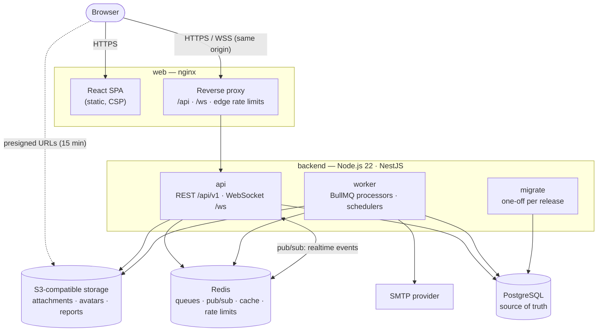
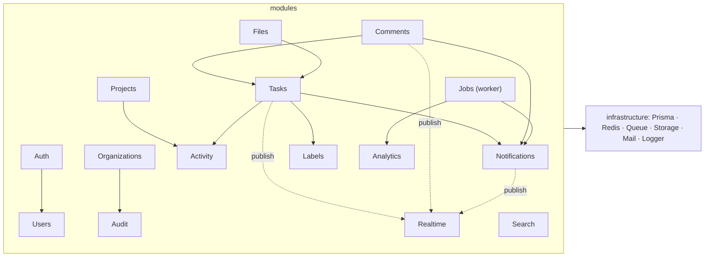
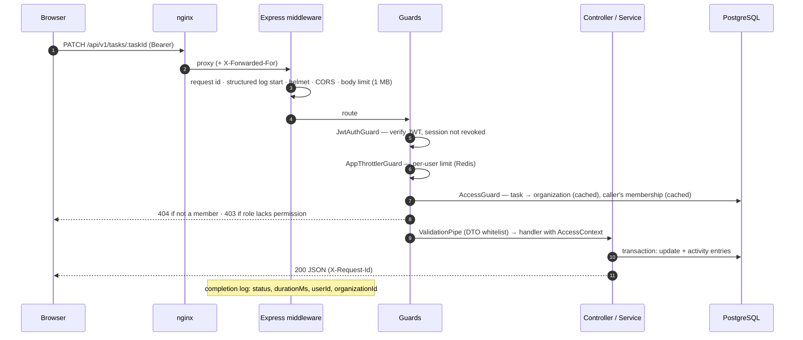
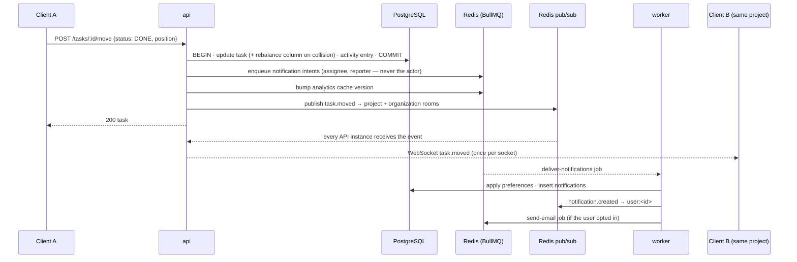

# FlowSync architecture

FlowSync is a multi-tenant, real-time work management platform: organizations, projects, Kanban
tasks, comments, files, notifications and analytics. This document describes how the pieces fit
together. Deeper dives: [database](database.md) · [real-time](realtime.md) ·
[security](security.md) · [deployment](deployment.md).

**Contents:** [System overview](#system-overview) · [Processes](#processes) ·
[Backend](#backend) · [Request lifecycle](#request-lifecycle) · [Write path](#write-path-a-task-move) ·
[Background jobs](#background-jobs) · [Web client](#web-client) · [Data stores](#data-stores) ·
[Observability](#observability) · [Performance](#performance) · [Failure modes](#failure-modes) ·
[Key decisions](#key-decisions)

---

## System overview



The browser talks to a single origin: nginx serves the SPA and proxies `/api` and `/ws` to the
API, so cookies, CORS and the WebSocket origin check are all same-origin. Only file bytes bypass
the API — browsers download them straight from object storage through short-lived presigned URLs.

## Processes

| Process     | Image target          | Responsibility                                                                 | Scaling               |
| ----------- | --------------------- | ------------------------------------------------------------------------------ | --------------------- |
| **web**     | `frontend/Dockerfile` | Static SPA, security headers, reverse proxy, edge rate limits                  | Stateless, any number |
| **api**     | `backend` → `api`     | REST API, WebSocket gateway, enqueues side effects                             | Stateless, any number |
| **worker**  | `backend` → `worker`  | Notifications, email, CSV reports, maintenance & retention, due-date reminders | Stateless, any number |
| **migrate** | `backend` → `migrate` | `prisma migrate deploy`, once per release before new api/worker versions start | One-off job           |

All three backend images come from the same compiled code. API instances share nothing in memory
that matters for correctness: sessions live in PostgreSQL, rate-limit counters and caches in Redis,
and real-time events fan out through Redis pub/sub, so any instance can serve any request or socket.
Locally, `RUN_WORKERS_IN_API=true` runs the processors inside the API for convenience.

## Backend

```
backend/src/
  main.ts · worker.ts     entry points (API: HTTP + WebSocket; worker: queues + health endpoint)
  bootstrap/              HTTP pipeline: helmet, CORS, cookies, body limits, validation, errors, Swagger
  config/                 environment validation (fails fast) and typed AppConfig
  common/                 auth decorators, RBAC + AccessGuard/AccessResolver, error model,
                          exception filter, validation pipe, log-context interceptor, utilities
  infrastructure/         Prisma, Redis (cache, throttler storage), BullMQ producers, S3 storage,
                          mail, structured logging
  modules/                auth · users · organizations · projects · tasks · comments · labels ·
                          notifications · files · activity · audit · analytics · search ·
                          realtime · health · jobs
```

Conventions: controllers are thin (DTO validation, access context, delegation); services hold the
business rules; repositories hold non-trivial queries. 98 routes, all documented in Swagger
(an integration test keeps the document complete).



## Request lifecycle



Every error — validation, authorization, Prisma, unexpected — is converted by one exception filter
into `{ code, message, fieldErrors?, requestId }`; 5xx responses never include internals.

## Write path: a task move

Writes commit first, then trigger side effects that must never fail the user's request:



- Positions are fractional (`positionBetween(before, after)`), so a move normally updates one row;
  when floating-point precision runs out the column is re-spaced in a single SQL statement.
- The web client applies moves optimistically and rolls back on error; its own echo is ignored.

## Background jobs

| Queue           | Jobs                                                                                                                                 | Retries                  |
| --------------- | ------------------------------------------------------------------------------------------------------------------------------------ | ------------------------ |
| `notifications` | deliver notifications; hourly due-date scan                                                                                          | 5, exponential from 2 s  |
| `email`         | transactional & notification email (payloads removed from Redis once sent)                                                           | 6, exponential from 10 s |
| `reports`       | CSV exports to object storage, `report.ready` event                                                                                  | 3, exponential from 15 s |
| `maintenance`   | expired sessions/tokens/invitations, old notifications/reports/audit entries, abandoned uploads, 30-day trash purge, storage cleanup | 3, exponential from 60 s |

Schedules are registered idempotently by every worker at startup (`upsertJobScheduler`), so any
number of workers can run. Jobs log completion with `durationMs`; final failures are logged as
errors and kept for 7 days (1 day for email).

## Web client

React 19 + TypeScript + Vite, TanStack Query for server state, Zustand for client state, React
Router with route-level code splitting, React Hook Form + Zod for forms, dnd-kit for the board,
Recharts (lazy-loaded) for analytics, Tailwind CSS 4.

- **Server state** lives only in the query cache; mutations update it optimistically and
  reconcile with the server response. Real-time events patch the cache directly and invalidate
  derived data in batches. After a WebSocket reconnect the client refetches on-screen queries,
  because events are not replayed.
- **Auth:** the access token is kept in memory only; the session is restored from the httpOnly
  refresh cookie on load. A single-flight interceptor refreshes on `401` and retries.
- **Permissions** mirror the API's role table for UX only; the API enforces them.
- See [`frontend/README.md`](../frontend/README.md) for structure and conventions.

## Data stores

| Store          | Holds                                                                                         | Loss impact                                     |
| -------------- | --------------------------------------------------------------------------------------------- | ----------------------------------------------- |
| PostgreSQL     | Everything durable: users, sessions, tenants, projects, tasks, comments, notifications, audit | Source of truth — back it up                    |
| Redis          | Job queues, pub/sub, caches, rate-limit counters, revocation denylist, lockout counters       | Pending jobs lost; caches rebuild; limits reset |
| Object storage | Attachments, avatars, generated reports                                                       | Files lost — enable versioning/backups          |

Schema, tenant integrity, indexes and migrations: [database.md](database.md).

## Observability

- **Logs:** structured JSON (pino) on stdout from every process, tagged with `service`, `env` and
  `version`. HTTP completion logs include the request id, method, path (sensitive query values
  redacted), client IP, status, `durationMs`, `userId` and `organizationId`; application logs
  written while handling a request carry the same request id, user and organization. Workers log
  every job with its queue, id, attempt and duration. Secrets and personal data are redacted —
  see [security.md](security.md#logging).
- **Correlation:** the web client sends `X-Request-Id` with every call and logs it for failed
  requests; the API reuses it (or mints one), returns it, and includes it in error bodies and in
  audit-log rows.
- **Health:** `GET /health/live` (liveness) and `GET /health` (readiness: PostgreSQL + Redis with
  latencies) on the API; the same on the worker's port 4001. All container images declare health checks.

## Performance

Reviewed during the production-readiness pass; the relevant properties:

- **Queries** are index-backed: partial indexes on live rows for every list (board column order,
  organization task list, due dates, completion), trigram GIN indexes for search, keyset
  pagination for feeds, composite indexes for membership checks. Analytics aggregate in SQL.
- **Caching:** membership (60 s) and resource→organization scopes (10 min) make authorization
  cost ~0 queries on hot paths; analytics are cached per organization with a version counter
  bumped on every relevant write.
- **Bounded responses:** paginated lists (20 per page by default, 100 max), feeds by cursor,
  boards capped at 5 000 tasks, 1 000 comments per task, 100 attachments per task, 1 MB JSON bodies.
- **Web bundle:** every route is lazy-loaded; charts and the board are separate chunks; the main
  chunk is ~111 kB gzipped. Hashed assets are cached immutably by nginx; `index.html` is not cached.
- **Real-time:** events are published once to Redis and fanned out per instance; each socket gets
  an event once even when subscribed to overlapping rooms; slow consumers are dropped instead of
  buffering without bound.

## Failure modes

| Failure              | Behaviour                                                                                                                                                                    |
| -------------------- | ---------------------------------------------------------------------------------------------------------------------------------------------------------------------------- |
| PostgreSQL down      | Readiness fails (`503`), load balancer stops routing; requests fail with `500`/`503`; no partial writes (transactions)                                                       |
| Redis down           | API keeps serving: caches, rate limits and revocation checks fail open (warnings); enqueueing times out after 3 s and is logged; real-time falls back to in-process delivery |
| Worker down          | Jobs queue up in Redis and run when a worker returns; nothing is lost                                                                                                        |
| SMTP down            | Email jobs retry with exponential backoff (6 attempts, ~5 minutes), then fail and are kept for inspection                                                                    |
| Object storage down  | Uploads/downloads fail; everything else works                                                                                                                                |
| API instance restart | Clients reconnect their WebSocket with backoff and refetch what's on screen                                                                                                  |

## Key decisions

- **Modular monolith + worker** rather than microservices: one codebase and schema, strong
  transactions, simple deployment; the worker split isolates slow and retryable work.
- **PostgreSQL-enforced tenancy** (composite foreign keys) in addition to application checks.
  Row-level security was considered and not enabled — see [database.md](database.md#row-level-security-considered-not-enabled).
- **Raw WebSocket + JSON protocol** instead of Socket.IO: small, explicit, easy to authorize per
  channel; Redis pub/sub for horizontal fan-out.
- **Opaque rotating refresh tokens + short JWTs** for instant revocation without a token lookup
  on every request.
- **`tsc` instead of the Nest CLI** for builds (the CLI needs Node ≥ 22.22).
