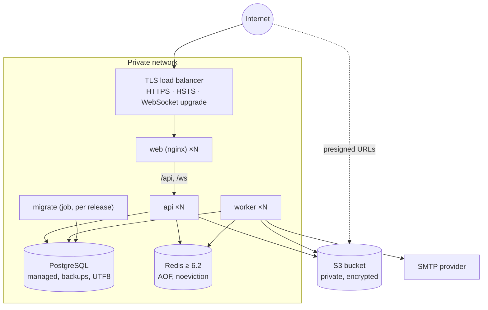

# Deploying FlowSync

How to build, configure, release and operate FlowSync. Local development with Docker is covered
at the end. Related: [architecture](architecture.md) · [security](security.md) ·
[database](database.md#migrations) · [real-time](realtime.md#operations).

**Contents:** [Topology](#topology) · [Images](#images) · [Configuration](#configuration) ·
[Release procedure](#release-procedure) · [Health checks & scaling](#health-checks--scaling) ·
[Infrastructure requirements](#infrastructure-requirements) · [CI/CD](#cicd) ·
[Observability](#observability) · [Backups & recovery](#backups--recovery) ·
[Local stack (docker compose)](#local-stack-docker-compose)

---

## Topology



- Only the load balancer is public. It terminates TLS, sets HSTS and forwards to the **web**
  containers, which serve the SPA and proxy `/api` and `/ws` to the **api** service.
- Alternatively route `/api` and `/ws` from the load balancer straight to the API and serve the
  SPA from the web containers or a CDN. Then the API sees one proxy hop fewer (adjust
  `TRUST_PROXY`) and the CDN must send the headers from `frontend/nginx/security-headers.inc.template`.
- No sticky sessions: every process is stateless.

## Images

| Image              | Build                                   | Runs                                | Port / health                    |
| ------------------ | --------------------------------------- | ----------------------------------- | -------------------------------- |
| `flowsync-web`     | `docker build frontend`                 | nginx (uid 101)                     | 8080 · `GET /healthz`            |
| `flowsync-api`     | `docker build --target api backend`     | `node dist/main.js` (user `node`)   | 4000 · `/health/live`, `/health` |
| `flowsync-worker`  | `docker build --target worker backend`  | `node dist/worker.js` (user `node`) | 4001 · `/health/live`, `/health` |
| `flowsync-migrate` | `docker build --target migrate backend` | `prisma migrate deploy`, then exits | —                                |

- Pass `--build-arg APP_VERSION=<git sha or tag>`; it appears in every log line and in the
  OpenAPI document.
- API/worker images contain production dependencies and compiled JavaScript only and run with a
  read-only root filesystem (mount a `tmpfs` at `/tmp`).
- Web client settings are build-time (`VITE_*` build args: API base URL, WebSocket URL, upload
  limit). The defaults (`/api/v1`, `/ws`) assume the same-origin topology above. Runtime nginx
  settings: `API_UPSTREAM`, `CSP_IMG_SRC` (your object-storage origin, for avatars and image
  previews), `CSP_CONNECT_SRC` (only if the API is on another origin).

## Configuration

The API and worker read the same environment variables (full list with defaults:
[`backend/.env.example`](../backend/.env.example) and
[`backend/README.md`](../backend/README.md#environment-variables)). Configuration is validated at
startup; unsafe production settings abort the process.

Production essentials:

| Variable                                  | Production value                                                                             |
| ----------------------------------------- | -------------------------------------------------------------------------------------------- |
| `NODE_ENV`                                | `production`                                                                                 |
| `DATABASE_URL`                            | Managed PostgreSQL, TLS (`?sslmode=require`), dedicated role                                 |
| `DATABASE_POOL_SIZE`                      | Connections per process (instances × pool ≤ database `max_connections` minus headroom)       |
| `REDIS_URL`                               | `rediss://…` with AUTH                                                                       |
| `JWT_ACCESS_SECRET`                       | ≥ 32 random characters from a secret manager (`openssl rand -base64 48`)                     |
| `APP_URL`                                 | Public web URL (links in emails)                                                             |
| `CORS_ORIGINS`                            | Public web origin(s) only                                                                    |
| `COOKIE_SECURE`                           | `true` (required)                                                                            |
| `TRUST_PROXY`                             | Number of proxy hops in front of the API (web nginx + load balancer = `2`), or their subnets |
| `S3_BUCKET` / `S3_REGION`                 | Private bucket; prefer an IAM role over `S3_ACCESS_KEY_ID`/`S3_SECRET_ACCESS_KEY`            |
| `S3_PUBLIC_ENDPOINT`                      | Only if browsers reach storage via a different host than the API                             |
| `MAIL_TRANSPORT` / `SMTP_*` / `MAIL_FROM` | `smtp` with your provider's credentials                                                      |
| `RUN_WORKERS_IN_API`                      | `false` (run the worker deployment)                                                          |
| `SWAGGER_ENABLED`                         | Leave unset (off) unless the docs should be public                                           |
| `LOG_LEVEL` / `LOG_PRETTY`                | `info` / `false`                                                                             |

`TRUST_PROXY` matters: rate limits, lockouts and audit logs use the client address. Too low and
all users share the proxy's address; too high and clients can spoof `X-Forwarded-For`. Never
expose the API port around the proxies.

## Release procedure

1. CI builds and tests the commit and (on `main`) builds all images tagged with the commit SHA.
2. **Migrate:** run the `flowsync-migrate` image once with the production `DATABASE_URL`
   (a Kubernetes Job, ECS task, `docker run --rm`, …). It applies pending migrations and exits
   non-zero on failure — stop the release if it does.
3. **Roll out** `flowsync-api`, `flowsync-worker` and `flowsync-web` with the same tag (rolling
   update; readiness gates traffic). Old and new versions briefly run side by side, so migrations
   must be backwards compatible (expand → deploy → contract across releases).
4. **Verify:** readiness endpoints, error rate and `durationMs` in the logs, a sign-in.
5. **Rollback:** redeploy the previous image tag. Migrations are forward-only; a schema change
   that the previous version can't run against needs a follow-up migration, not a rollback.

Shutdowns are graceful: on `SIGTERM` the API stops accepting connections, closes WebSockets with
`1001` (clients reconnect elsewhere), drains, and disconnects from PostgreSQL/Redis; workers
finish active jobs. Allow ≥ 30 s termination grace.

## Health checks & scaling

| Probe                       | API                             | Worker                          | Web                 |
| --------------------------- | ------------------------------- | ------------------------------- | ------------------- |
| Liveness (restart if fails) | `GET :4000/health/live`         | `GET :4001/health/live`         | `GET :8080/healthz` |
| Readiness (route traffic)   | `GET :4000/health` (DB + Redis) | `GET :4001/health` (DB + Redis) | `GET :8080/healthz` |

Readiness returns `503` with `{ status: "error", checks: { database: { status: "down" } … } }`
when a dependency is unreachable; details are logged, not returned. Health routes are excluded
from request logging and rate limiting.

- **api:** scale on CPU / request latency. WebSockets are spread across instances via Redis
  pub/sub.
- **worker:** scale on queue depth (`bull:<queue>:wait` length). Concurrency per process:
  notifications 10, email 5, reports 2, maintenance 2.
- **web:** trivially horizontal.

## Infrastructure requirements

| Component      | Requirement                                                                                                     |
| -------------- | --------------------------------------------------------------------------------------------------------------- |
| PostgreSQL     | 14+ (tested with 18), UTF8 encoding, `pg_trgm` available (created by the first migration), daily backups + PITR |
| Redis          | 6.2+ or Valkey, `maxmemory-policy noeviction` (BullMQ), AOF persistence, private network, AUTH/TLS              |
| Object storage | S3 or compatible, private bucket, encryption at rest, lifecycle for incomplete multipart uploads                |
| SMTP           | Authenticated provider with SPF/DKIM for `MAIL_FROM`'s domain                                                   |
| Node.js        | Images ship Node 22 (Alpine); from source: Node ≥ 22.12                                                         |

In production the API does not create the bucket; provision it (and its CORS rule, only needed
for direct browser uploads) with your infrastructure code.

## CI/CD

[`.github/workflows/ci.yml`](../.github/workflows/ci.yml):

| Trigger        | Jobs                                                                                                                                                                                                                                                                                                                                    |
| -------------- | --------------------------------------------------------------------------------------------------------------------------------------------------------------------------------------------------------------------------------------------------------------------------------------------------------------------------------------- |
| Pull request   | **backend** (install, format, lint, typecheck, unit tests + coverage, build) · **backend-integration** (PostgreSQL/Redis/S3 via compose; schema validation, migrations on an empty DB, drift checks, seed idempotency, API integration tests) · **frontend** (install, format, lint, typecheck, tests + coverage, build, bundle report) |
| Push to `main` | All of the above, then **docker**: builds the api, worker, migrate and web images (tagged with the commit SHA), boots the full stack with docker compose and smoke-tests it                                                                                                                                                             |

Nothing is deployed automatically. Setting the repository variable `PUSH_IMAGES=true` pushes the
images to `ghcr.io/<owner>/flowsync-*:<sha>`; add a separate, explicitly configured deployment
workflow (with environment protection rules / required reviewers) that runs the migrate job and
rolls out those tags.

## Observability

- **Logs:** JSON on stdout from every container — ship them to your log platform. Useful fields:
  `service`, `version`, `req.id` (= `X-Request-Id`), `userId`, `organizationId`,
  `res.statusCode`, `durationMs`, `err`. Workers: `queue`, `job`, `jobId`, `attempt`,
  `durationMs`. Alert on `level >= 50` (error), 5xx rate, p95 `durationMs`, and
  "Job failed permanently".
- **Probes:** readiness includes dependency latencies (`latencyMs`).
- **Queues:** watch waiting/failed counts per queue (e.g. with a BullMQ dashboard on a private
  network).
- **Web:** failed API calls are logged in the browser console with their request id; wire an
  error tracker if needed (upload the hidden source maps produced by `vite build` — they are
  removed from the image).

## Backups & recovery

- PostgreSQL holds all durable state: automated backups with point-in-time recovery; test
  restores.
- Object storage: versioning or replication for attachments.
- Redis: AOF persistence keeps pending jobs across restarts; losing it loses pending jobs and
  resets rate limits and caches, nothing else.
- Secrets: rotating `JWT_ACCESS_SECRET` invalidates outstanding access tokens only. Refresh tokens
  are opaque database records, so clients transparently obtain a new access token on their next
  request (one extra refresh per active client); nobody is signed out.

---

## Local stack (docker compose)

The root [`docker-compose.yml`](../docker-compose.yml) runs everything locally with health checks:

```bash
docker compose up -d --build     # web http://localhost:8080 · API :4000 · Mailpit http://localhost:8025
docker compose ps                # all services "healthy"; migrate "exited (0)"
docker compose logs -f backend worker
docker compose down              # keep data  (docker compose down -v to wipe it)
```

| Service    | Purpose                                             | Host port              |
| ---------- | --------------------------------------------------- | ---------------------- |
| `frontend` | nginx: SPA + `/api`, `/ws` proxy                    | 8080                   |
| `backend`  | API + WebSocket gateway (Swagger at `/api/v1/docs`) | 4000                   |
| `worker`   | Background jobs                                     | —                      |
| `migrate`  | Applies migrations, then exits                      | —                      |
| `postgres` | PostgreSQL 18                                       | 5432                   |
| `redis`    | Valkey 8 (Redis-compatible)                         | 6379                   |
| `s3`       | SeaweedFS S3 API                                    | 9000                   |
| `mailpit`  | Catches all email                                   | 1025 (SMTP), 8025 (UI) |

- Start order is enforced with health checks: infrastructure → `migrate` (must succeed) →
  `backend` + `worker` → `frontend`.
- Ports and the JWT secret can be overridden in a root `.env` (see [`.env.example`](../.env.example)),
  e.g. to run a second copy: `WEB_PORT=18080 API_PORT=14000 … docker compose -p flowsync-copy up -d`.
- Containers run the production images with `NODE_ENV=development` (plain-HTTP cookies, bucket
  auto-creation, Swagger). Load demo data (`demo@flowsync.dev` / `Password123!`) with
  `docker compose run --rm -e NODE_ENV=development migrate prisma db seed`.
- Only infrastructure (to run the API and web client from source):
  `docker compose up -d postgres redis s3 mailpit`.
