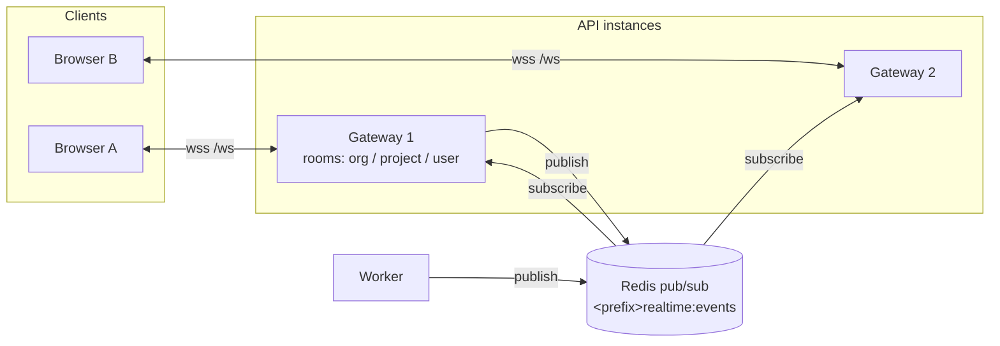
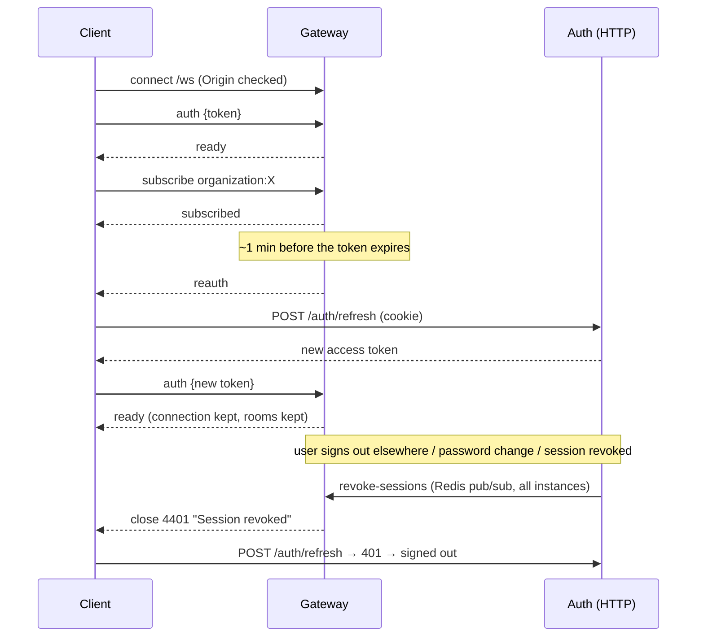

# FlowSync real-time

Live updates (boards, comments, notifications, membership changes) are delivered over a plain
WebSocket with a small JSON protocol. Server: [`backend/src/modules/realtime`](../backend/src/modules/realtime);
client: [`frontend/src/lib/realtime`](../frontend/src/lib/realtime).

**Contents:** [Overview](#overview) · [Protocol](#protocol) · [Channels & authorization](#channels--authorization) ·
[Events](#events) · [Authentication lifecycle](#authentication-lifecycle) · [Fan-out across instances](#fan-out-across-instances) ·
[Delivery guarantees](#delivery-guarantees) · [Limits](#limits) · [Client behaviour](#client-behaviour) ·
[Operations](#operations)

---

## Overview

Any API instance or worker publishes an event once to Redis; every API instance receives it and
delivers it to its own sockets that joined a matching room. Sockets can therefore connect to any
instance — no sticky sessions required.

## Protocol

Endpoint: `/ws` (same origin as the web client; nginx proxies it to the API). Messages are JSON
objects with a `type`.

| Direction       | Message                                                   | Meaning                                                                |
| --------------- | --------------------------------------------------------- | ---------------------------------------------------------------------- |
| client → server | `{ "type": "auth", "token": "<accessToken>" }`            | Authenticate (first message, within 10 s) or re-authenticate           |
| server → client | `{ "type": "ready", "payload": { "userId" } }`            | Authenticated; the private `user:<id>` channel is joined automatically |
| client → server | `{ "type": "subscribe", "channel": "organization:<id>" }` | Join a room (`organization:<id>` or `project:<id>`)                    |
| server → client | `{ "type": "subscribed", "payload": { "channel" } }`      | Room joined                                                            |
| client → server | `{ "type": "unsubscribe", "channel": "…" }`               | Leave a room                                                           |
| client → server | `{ "type": "ping" }`                                      | Application-level keep-alive → `{ "type": "pong" }`                    |
| server → client | `{ "type": "reauth" }`                                    | The access token expires within a minute: send a fresh `auth`          |
| server → client | `{ "type": "<event>", "payload": … }`                     | A domain event (below)                                                 |
| server → client | `{ "type": "error", "payload": { "code", "message" } }`   | `UNAUTHORIZED`, `FORBIDDEN`, `BAD_REQUEST`, `INTERNAL_ERROR`           |

Close codes: `1008` origin not allowed · `4401` missing/invalid/expired token or revoked session
(the client refreshes and reconnects) · `4429` too many messages · `1001` server shutting down.

## Channels & authorization

| Channel             | Who may join                          | Carries                                             |
| ------------------- | ------------------------------------- | --------------------------------------------------- |
| `user:<userId>`     | That user only (joined automatically) | Their notifications; membership removal notices     |
| `organization:<id>` | Members of the organization           | Task, comment, project and member events of the org |
| `project:<id>`      | Members of the project's organization | Task and comment events of the project              |

Authorization runs on every `subscribe` with the same resolver as HTTP requests (cached
membership, project → organization lookup from the database). Malformed ids, other tenants'
channels and other users' private channels are refused with `FORBIDDEN`. When a member is removed
from an organization, a `revoke` message removes their sockets from that organization's rooms on
every instance immediately.

## Events

| Event                  | Rooms                  | Payload                                               |
| ---------------------- | ---------------------- | ----------------------------------------------------- |
| `task.created`         | project + organization | Task (also sent when a task is restored)              |
| `task.updated`         | project + organization | Task (fields, labels, counters, rebalanced positions) |
| `task.moved`           | project + organization | Task after a board move                               |
| `task.deleted`         | project + organization | `{ id, projectId }`                                   |
| `comment.created`      | project + organization | Comment                                               |
| `project.updated`      | project + organization | `{ id, deleted? }`                                    |
| `member.updated`       | organization (+ user)  | `{ organizationId, action, member?, … }`              |
| `notification.created` | user                   | Notification                                          |
| `report.ready`         | user                   | Report                                                |

Each socket receives an event once, even when it joined several rooms the event targets. Wire
names are shared by `realtime.events.ts` (server) and `events.ts` (client).

## Authentication lifecycle

- A connection never outlives its credentials. The server remembers each socket's token expiry
  and device session. It asks for a fresh token (`reauth`) 60 s before expiry and closes the
  socket with `4401` if none arrives within 30 s after expiry (older clients that ignore `reauth`
  simply reconnect).
- Re-authentication must be for the same user; switching users on an open socket is refused.
- Revoking a session — logout, "sign out other sessions", password change or reset, account
  deletion, refresh-token reuse detection — publishes `revoke-sessions`; every instance closes the
  matching sockets immediately, before any further event is delivered.

## Fan-out across instances

- Channel: `<REDIS_KEY_PREFIX>realtime:events` (one channel; messages carry their target rooms).
- Each API instance keeps an in-memory map `room → sockets`; workers only publish.
- If publishing to Redis fails, the API delivers the event to its own sockets and logs a warning,
  so single-instance deployments keep working during a Redis blip.

## Delivery guarantees

Real-time delivery is **best-effort, at-most-once**: events are not persisted or replayed. The
database stays the source of truth, and the client compensates:

- After a reconnect (API restart, network change, laptop sleep) the client refetches every query
  that is on screen and marks the rest stale.
- A client ignores echoes of its own in-flight changes (its mutation reconciles them).
- Notification counts poll when the socket is down.

Events are published **after** the database transaction commits, so a client never sees an event
for a change that was rolled back.

## Limits

| Limit                        | Value                                         |
| ---------------------------- | --------------------------------------------- |
| Authentication deadline      | 10 s after connecting                         |
| Frame size                   | 16 KiB (larger frames close the socket)       |
| Inbound messages             | 60 per 10 s per connection (`4429`)           |
| Subscriptions per connection | 50                                            |
| Slow consumers               | Terminated when > 1 MiB is buffered           |
| Heartbeat                    | Server ping every 30 s; dead peers terminated |
| Concurrent sockets per IP    | 20 (nginx `limit_conn`)                       |

## Client behaviour

`RealtimeClient` (framework-agnostic) + `RealtimeProvider` (React):

- authenticates with the in-memory access token after connecting; status becomes `open` on `ready`;
- re-subscribes to its channels after every reconnect; reconnects with exponential backoff and
  jitter (immediately when the browser comes back online);
- on `4401` refreshes the session once and reconnects (stops after 3 consecutive rejections);
  on `reauth` refreshes and re-authenticates in place;
- calls `onReconnect` after a re-established connection so the app refetches on-screen data;
- feature modules register handlers (`features/*/realtime.ts`) that patch the TanStack Query cache.

## Operations

- **Proxies/load balancers** must allow WebSocket upgrades on `/ws` and idle timeouts longer than
  the 30 s heartbeat (the bundled nginx uses 1 h). No sticky sessions are needed.
- **Origins:** `CORS_ORIGINS` is also the WebSocket origin allow-list.
- **Scaling:** add API instances freely; each subscribes to the pub/sub channel. A single Redis
  handles far more fan-out than typical deployments need; use a dedicated Redis if pub/sub
  traffic competes with queues.
- **Graceful shutdown:** instances close sockets with `1001`; clients reconnect to another instance.
