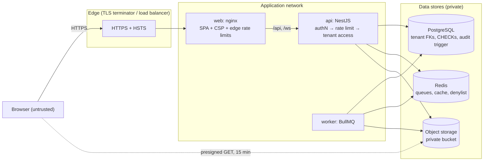

# FlowSync security

How FlowSync protects accounts and tenant data, what the production-readiness review found, and
what remains an accepted risk. Related: [architecture](architecture.md) ·
[real-time](realtime.md) · [deployment](deployment.md) · [database](database.md#multi-tenancy).

**Contents:** [Trust boundaries](#trust-boundaries) · [Review summary](#review-summary) ·
[Authentication](#authentication) · [Authorization & tenant isolation](#authorization--tenant-isolation) ·
[Browser security](#browser-security-cors-csrf-xss-headers) · [Rate limiting](#rate-limiting) ·
[File uploads](#file-uploads) · [Input validation & injection](#input-validation--injection) ·
[Secrets](#secrets) · [Logging](#logging) · [Accepted risks](#accepted-risks) ·
[Operational checklist](#operational-checklist)

---

## Trust boundaries

Everything arriving from the browser is untrusted, including ids in URLs, file names, MIME types
and the `Origin`/`X-Forwarded-For` headers. Only the web container (and, optionally, the API for
non-browser clients) is reachable from outside; databases, Redis, object storage and the worker
live on a private network. Browsers reach stored files only through short-lived presigned URLs.

---

## Review summary

The review covered every area below against the running system (unit tests, integration tests
against PostgreSQL/Redis/S3, and manual probes). Most controls were already in place; the
findings and their fixes:

| Area              | Finding                                                                                                                                                                        | Severity | Status                                                                                                                                          |
| ----------------- | ------------------------------------------------------------------------------------------------------------------------------------------------------------------------------ | -------- | ----------------------------------------------------------------------------------------------------------------------------------------------- |
| Authentication    | An authenticated WebSocket stayed open — and kept receiving tenant events — after logout, session revocation, password change or account deletion, and after its token expired | High     | **Fixed:** revoking a session closes its sockets on every instance (`4401`); sockets must re-authenticate (`reauth`) before their token expires |
| Logging / privacy | Request URLs were logged with their query strings (`?search=<name or email>`)                                                                                                  | Medium   | **Fixed:** sensitive query values are redacted; email fields are redacted anywhere in log objects                                               |
| Secret handling   | Sent emails (containing one-time verification / reset / invitation links) stayed in Redis for 24 h as completed BullMQ jobs                                                    | Medium   | **Fixed:** removed on completion; failed ones kept 1 day                                                                                        |
| Information leak  | The public readiness probe returned raw driver errors (internal host names/IPs)                                                                                                | Low      | **Fixed:** generic `up`/`down`; details go to the logs only                                                                                     |
| API surface       | Swagger UI was enabled by default in production                                                                                                                                | Low      | **Fixed:** off in production unless `SWAGGER_ENABLED=true`                                                                                      |
| XSS hardening     | The web client had no Content-Security-Policy (it was served by the dev server only) and used an inline script                                                                 | Low      | **Fixed:** nginx serves a strict CSP (`script-src 'self'`, no inline scripts) plus frame, sniffing and referrer protections                     |
| Brute force       | Invitation acceptance only had the global rate limit                                                                                                                           | Low      | **Fixed:** 10 attempts / 15 min                                                                                                                 |
| Rate limiting     | Behind a proxy the API must see real client addresses                                                                                                                          | Config   | **Fixed in compose:** `TRUST_PROXY=1` with nginx appending `X-Forwarded-For`; documented for production                                         |
| API documentation | The public avatar endpoint was documented as requiring a token; one tag was undeclared                                                                                         | Info     | **Fixed**, and guarded by an automated test                                                                                                     |

No SQL injection, tenant-isolation, IDOR, XSS or CSRF vulnerabilities were found. The integration
suite now proves the isolation and authentication properties end to end
(`backend/test/integration/*.e2e-spec.ts`).

---

## Authentication

| Control             | Implementation                                                                                                                                                                           |
| ------------------- | ---------------------------------------------------------------------------------------------------------------------------------------------------------------------------------------- |
| Password storage    | Argon2id (19 MiB, t=2, p=1 — OWASP), transparent rehash on sign-in when parameters change                                                                                                |
| Password policy     | 8–128 characters (server); the client additionally requires a letter and a digit and shows a strength meter                                                                              |
| Account enumeration | Sign-in uses one message and equal work for unknown accounts (dummy Argon2 verification); forgot-password / resend-verification always return `204`                                      |
| Brute force         | Per-account lockout (5 failures → 15 min, keyed by a hash of the email) plus per-IP limits on every auth endpoint                                                                        |
| Email verification  | Required before sign-in (configurable); single-use, hashed, expiring tokens (24 h verification, 1 h reset)                                                                               |
| Access tokens       | HS256 JWT, 15 min, `iss`/`aud`/`alg` pinned, `typ: access` enforced; kept in memory by the web client (never in storage)                                                                 |
| Refresh tokens      | Opaque 256-bit, stored as SHA-256 only, rotated on every use with reuse detection (replay outside a 60 s grace window revokes the session); httpOnly `SameSite` cookie on `/api/v1/auth` |
| Revocation          | Logout, password change/reset, session revocation and account deletion revoke sessions in PostgreSQL, add them to a Redis denylist for one token lifetime and close their WebSockets     |
| Sessions            | Users see and revoke device sessions; "keep me signed in" off → browser-session cookie + 24 h sliding lifetime                                                                           |

The WebSocket gateway authenticates with the same access token (first message, 10 s timeout),
checks the denylist, and enforces expiry on long-lived connections — see [realtime.md](realtime.md#authentication-lifecycle).

---

## Authorization & tenant isolation

- **Secure by default.** A global guard chain runs on every HTTP route: JWT authentication (unless
  `@Public()`), rate limiting, then `AccessGuard`. Any route parameter naming an
  organization-owned resource (`organizationId`, `projectId`, `taskId`, `commentId`,
  `attachmentId`) is resolved _from the database_ to its organization, and the caller must be a
  member of **that** organization. A route that forgets `@RequirePermission` is still
  membership-checked; a permission on a route without a scope fails loudly at runtime.
- **404, not 403,** for other tenants' resources, so ids can't be probed for existence. `403` only
  means "member, but your role can't do this".
- **RBAC:** `OWNER > ADMIN > MANAGER > MEMBER > VIEWER` (`common/authorization/permissions.ts`).
  Role changes are rank-restricted (nobody can grant `OWNER` or a role at/above their own).
  The client mirrors the table for UX only.
- **Defense in depth in the database.** Tenant-owned rows carry `organization_id`, and composite
  foreign keys `(id, organization_id)` make cross-tenant references impossible even if application
  code were wrong: a task can't point at another organization's project, label or assignee.
  Services additionally scope every query by organization. See [database.md](database.md#multi-tenancy).
- **Caches** only hold data every reader of the key may see (keys include the organization);
  membership entries are invalidated on every change, and a removed member's WebSocket
  subscriptions to that organization are dropped immediately.
- **Soft-deleted** resources behave as not found everywhere except the explicit restore routes.

Verified by `isolation.e2e-spec.ts`: 13 read routes and 7 write routes against another tenant's
organization, project, task, comments and attachments return 404 and leak nothing; foreign labels
and assignees are rejected; lists, search and `projectId` filters can't widen the scope; foreign
WebSocket channels are refused and their events never delivered.

---

## Browser security (CORS, CSRF, XSS, headers)

- **CORS:** explicit origin allow-list (`CORS_ORIGINS`), credentials only for listed origins,
  limited methods/headers. In the recommended deployment the web client and API share one origin
  behind nginx, so browsers never make cross-origin API calls at all.
- **CSRF:** API calls authenticate with a bearer header, which browsers never attach automatically.
  The only cookie-authenticated endpoints (`/auth/refresh`, `/auth/logout`) require an allowed
  `Origin`, and the cookie is `SameSite=Lax` and path-scoped. The WebSocket handshake checks
  `Origin` too (cross-site WebSocket hijacking).
- **XSS:** React escapes all rendered text; there is no `dangerouslySetInnerHTML` or HTML
  rendering of user content. Emails HTML-escape every interpolated value. Uploaded files are never
  served from the application origin: downloads are presigned object-storage URLs that force
  `Content-Disposition: attachment`, and active content (HTML, SVG, scripts) is rejected at upload.
- **Headers (web):** strict CSP (`default-src 'self'; script-src 'self'; object-src 'none';
frame-ancestors 'none'; base-uri 'self'; form-action 'self'`), `X-Frame-Options: DENY`,
  `X-Content-Type-Options: nosniff`, `Referrer-Policy`, `Permissions-Policy`,
  `Cross-Origin-Opener-Policy`. Source maps are not shipped.
- **Headers (API):** helmet — CSP for Swagger UI, HSTS in production, no-sniff, frame denial,
  `Referrer-Policy: no-referrer`, `Cross-Origin-Resource-Policy: same-site`, no `X-Powered-By`.

---

## Rate limiting

| Layer           | Limit                                                                                                             |
| --------------- | ----------------------------------------------------------------------------------------------------------------- |
| nginx (edge)    | 30 req/s per IP (burst 200) on `/api/`; 20 concurrent WebSockets per IP                                           |
| API, global     | 300 requests / 60 s per user (per IP when anonymous) — Redis-backed, shared by all instances                      |
| API, auth       | register 5/min · login 10/min · refresh 30/min · forgot/resend 5 per 15 min · reset/verify 10 per 15 min (per IP) |
| API, sensitive  | password change and account deletion 5 per 15 min · invitation acceptance 10 per 15 min                           |
| Account lockout | 5 failed sign-ins → locked 15 min                                                                                 |
| WebSocket       | 60 messages / 10 s per connection, 16 KiB frames, 50 subscriptions, slow consumers dropped at 1 MiB buffered      |

Rate limits key on the client address, so the API must see it: set `TRUST_PROXY` to the number of
proxies in front of it (or their subnets) and make sure the API is not reachable around them
(otherwise `X-Forwarded-For` can be spoofed). If Redis is down, limits fail open (logged).

---

## File uploads

- Extension allow-list **and** content sniffing (magic bytes; UTF-8 without NUL bytes for text).
  Declared MIME types are ignored. HTML, SVG, scripts and executables are never accepted.
- Size limits enforced while streaming (multer `fileSize`, one file per request) and again for
  direct uploads (declared size = stored size); nginx caps request bodies at 30 MB.
- Private bucket; keys are generated (`orgs/<org>/projects/<project>/tasks/<task>/<uuid>.<ext>`), never derived from
  file names. File names are stripped of paths and control characters and only used in
  `Content-Disposition` (RFC 6266/5987 encoded).
- Presigned URLs live 15 minutes; attachments download as `attachment`. Avatars (images only)
  render inline through a redirect.
- At most 100 attachments per task; abandoned direct uploads are purged hourly.

---

## Input validation & injection

- Global `ValidationPipe` with whitelisting and `forbidNonWhitelisted` (unknown fields → 422),
  strict enums, UUID route params, real calendar dates, length limits matching column sizes,
  array size caps, 1 MB JSON body limit.
- **SQL injection:** all queries go through Prisma; the few raw queries (analytics aggregates,
  column rebalancing) use tagged templates, which send values as bound parameters. No string
  concatenation reaches SQL. Malformed ids are rejected before any query.
- CSV exports neutralize spreadsheet formula injection (cells starting with `=`, `+`, `-`, `@`, tab or CR are prefixed with `'`).
- WebSocket messages are size-capped JSON with a whitelisted set of message types.

---

## Secrets

- Secrets exist only in the backend's environment (database/Redis credentials, JWT secret, S3
  keys, SMTP password). The web bundle contains none — `VITE_*` values are public by definition.
- Startup validation refuses unsafe production configuration: missing/short/example JWT secret,
  `COOKIE_SECURE=false`, log-only email.
- Refresh, verification, reset and invitation tokens are stored as SHA-256 hashes; login-failure
  counters key on a hash of the email.
- `.env` files are git-ignored everywhere; the root compose file uses a development-only JWT secret
  that production validation would reject. Use a secret manager (and IAM roles instead of static
  S3 keys) in production.

---

## Logging

Structured JSON (pino). Every line carries `service`, `env` and `version`; request logs carry the
request id (`req.id`, echoed as `X-Request-Id`), method, path, client IP, status, `durationMs`,
`userId` and `organizationId` once known; errors include the stack server-side only.

Never logged: `Authorization` and `Cookie` headers, `Set-Cookie`, any `password`, `token`,
`accessToken`, `refreshToken`, `secret` or `email` field (redacted as `[REDACTED]` at any depth
pino supports), the values of `search`, `q`, `email`, `token` and similar query parameters, and
job payloads (which contain email addresses). 5xx responses never include internal details; clients
get a request id to quote instead. The `log` mail transport (which prints one-time links) is
refused in production.

Client IP addresses are logged for security investigation; cover them in your log-retention
policy.

---

## Accepted risks

- **Registration reveals whether an email is registered** (`409`). This is the expected UX for
  sign-up; it is rate-limited (5/min per IP). Sign-in and password reset do not reveal it.
- **Fail-open on Redis outages:** rate limits, lockout counters and the revocation denylist are
  skipped (with warnings) rather than taking the product down. Refresh-token revocation in
  PostgreSQL still applies, so a revoked session loses access within one access-token lifetime.
- **HS256** (shared secret) rather than asymmetric JWTs: only the API issues and verifies tokens.
  Rotate the secret by deploying a new one; outstanding access tokens stop verifying and clients
  refresh transparently (refresh tokens are opaque and unaffected).
- **Redis holds pending email jobs** (with one-time links) until they are sent; protect Redis like
  the database (private network, AUTH/TLS, no public exposure).
- **No malware scanning** of uploads. Files are type-verified and never executed or rendered on the
  app origin; add scanning (e.g. ClamAV or the object store's service) if your threat model needs it.

---

## Operational checklist

- `NODE_ENV=production`, `COOKIE_SECURE=true`, unique `JWT_ACCESS_SECRET` (≥ 32 random chars),
  `MAIL_TRANSPORT=smtp`, `CORS_ORIGINS` = your web origin(s) only.
- TLS at the edge with HSTS; only the web entry point is public. `TRUST_PROXY` matches your proxy chain.
- PostgreSQL, Redis and object storage on private networks with credentials/TLS; Redis `noeviction`.
- Private bucket with encryption at rest; IAM role instead of static keys.
- Keep `SWAGGER_ENABLED` unset (off) on public production deployments.
- Run `npm audit` / Dependabot regularly; rebuild images for base-image security updates.

To report a vulnerability, contact the maintainers privately rather than opening a public issue.
